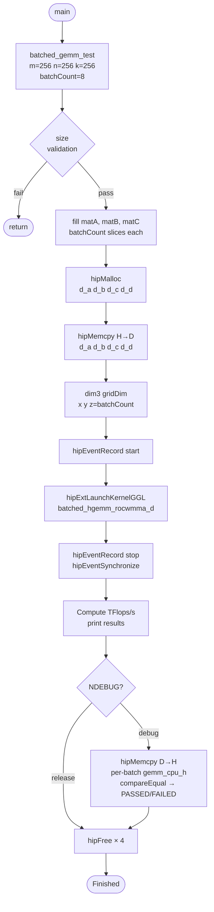
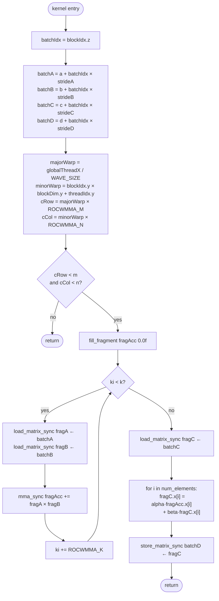

# simple_batched_hgemm — General Batched FP16 GEMM Sample

## Overview

This sample demonstrates a **general Batched Matrix Multiplication** (BMM) using rocWMMA.
All batch slices are dispatched in a **single GPU kernel call** by mapping the batch
dimension to `blockIdx.z`.

```
D[b] = alpha * ( A[b] × B[b] ) + beta * C[b]     for b = 0 .. batchCount-1

A[b]:  M × K  (row-major)
B[b]:  K × N  (col-major)
C[b]:  M × N  (row-major)   — bias / residual
D[b]:  M × N  (row-major)   — output
```

The most common use-case is **Multi-Head Attention (MHA)**, where each attention head
is one independent batch slice:

```
Q × K^T  →  scores[h]     (each head h is one batch)
scores[h] × V  →  context[h]
```

### Difference from `simple_dlrm`

| Sample | BMM formula | Use case |
|---|---|---|
| `simple_dlrm.cpp` | `A[b] × A[b]^T` | DLRM self-interaction (A is query and key simultaneously) |
| **`simple_batched_hgemm.cpp`** | **`A[b] × B[b]`** | **General BMM: separate A and B per batch** |

`simple_dlrm` only handles the self-interaction dot product.  This sample handles the
general case where A and B are independent matrices.

---

## Data Layouts

| Matrix | Shape | Type | Layout | Leading dim | Batch stride |
|---|---|---|---|---|---|
| A | M × K | `float16_t` | row\_major | K | M × K |
| B | K × N | `float16_t` | col\_major | K | K × N |
| C | M × N | `float16_t` | row\_major | N | M × N |
| D | M × N | `float16_t` | row\_major | N | M × N |

B is stored **col-major** (K × N physical layout, stride between consecutive columns = K),
consistent with `simple_hgemm.cpp`.  This lets `load_matrix_sync` address B with:

```cpp
batchB + (ki + cCol * ldb)   // ki = K-tile offset, ldb = K
```

---

## Tile and Launch Configuration

```
Tile:   ROCWMMA_M=16, ROCWMMA_N=16, ROCWMMA_K=16
Block:  T_BLOCK_X = 4 × WAVE_SIZE,  T_BLOCK_Y = 4
Wave:   one wave per ROCWMMA_M × ROCWMMA_N output tile
```

Grid dimensions:

```
gridDim.x = ceil( M / (ROCWMMA_M × T_BLOCK_X / WAVE_SIZE) )   ← M-tiles
gridDim.y = ceil( N / (ROCWMMA_N × T_BLOCK_Y) )               ← N-tiles
gridDim.z = batchCount                                          ← batch slices
```

Architecture-specific values:

| Architecture | WAVE\_SIZE | T\_BLOCK\_X | Waves per block |
|---|---|---|---|
| gfx9 (MI200 / MI300X) | 64 (Wave64) | 256 | 4 |
| gfx12 (RDNA4 / RX 9070) | 32 (Wave32) | 128 | 4 |

For the default test (M=N=K=256, batchCount=8):

```
gridDim = (4, 4, 8)   on gfx12 (WAVE_SIZE=32, T_BLOCK_X=128)
```

---

## Fragment Types

```cpp
using InputT   = float16_t;
using ComputeT = float32_t;

// A sub-tile per mma_sync call
fragment<matrix_a,    ROCWMMA_M, ROCWMMA_N, ROCWMMA_K, float16_t, row_major>  fragA;

// B sub-tile per mma_sync call (col_major matches the B storage layout)
fragment<matrix_b,    ROCWMMA_M, ROCWMMA_N, ROCWMMA_K, float16_t, col_major>  fragB;

// fp16 output tile — used for alpha/beta scaling and final store
fragment<accumulator, ROCWMMA_M, ROCWMMA_N, ROCWMMA_K, float16_t>             fragC;

// fp32 accumulator — collects the MFMA dot products
fragment<accumulator, ROCWMMA_M, ROCWMMA_N, ROCWMMA_K, float32_t>             fragAcc;
```

The mixed-precision pipeline:

```
fp16 A, B  →  MFMA  →  fp32 fragAcc  →  alpha·acc + beta·C  →  fp16 D
```

---

## Code Structure

```
simple_batched_hgemm.cpp
│
├── Constants
│   ROCWMMA_M/N/K = 16
│   WAVE_SIZE     = getWarpSize()   (runtime, Wave32 or Wave64)
│   T_BLOCK_X     = 4 × WAVE_SIZE
│   T_BLOCK_Y     = 4
│
├── batched_hgemm_rocwmma_d()        ← GPU kernel
│   ├── batchIdx = blockIdx.z
│   ├── batchA/B/C/D = base + batchIdx × stride
│   ├── wave→tile mapping (majorWarp, minorWarp)
│   ├── K-loop: load fragA, fragB → mma_sync → fragAcc
│   ├── load fragC → alpha·fragAcc + beta·fragC → fragC
│   └── store fragC → batchD
│
├── batched_gemm_test()              ← Host driver
│   ├── size validation
│   ├── fill<float16_t> matA, matB, matC
│   ├── hipMalloc / hipMemcpy
│   ├── dim3 gridDim (x, y, z=batchCount)
│   ├── hipExtLaunchKernelGGL → batched_hgemm_rocwmma_d
│   ├── hipEventElapsedTime → TFlops/s
│   └── [!NDEBUG] per-batch gemm_cpu_h loop → compareEqual
│
└── main()
    └── batched_gemm_test(256, 256, 256, 8, 1.0f, 0.0f)
```

---

## Flow Charts

### 1 — Host Program Flow



---

### 2 — Kernel: Batch Dispatch via `blockIdx.z`



---

### 3 — Batch Parallelism: Grid Z-dimension

```mermaid
block-beta
    columns 4
    block:b0["Batch 0\nblockIdx.z=0\nA[0]×B[0]→D[0]"]:1
    block:b1["Batch 1\nblockIdx.z=1\nA[1]×B[1]→D[1]"]:1
    block:b2["Batch 2..6\n...parallel..."]:1
    block:b7["Batch 7\nblockIdx.z=7\nA[7]×B[7]→D[7]"]:1
```

Each batch slice runs as an independent sub-grid of `gridDim.x × gridDim.y` blocks.
All slices execute **concurrently** on the GPU — there is no host-side loop.

---

## Address Arithmetic

For a wave assigned to output tile `(cRow, cCol)` in batch `batchIdx`:

| Load | Address | Explanation |
|---|---|---|
| A tile start | `batchA + cRow * lda + ki` | row `cRow`, K-offset `ki`, `lda=K` |
| B tile start | `batchB + ki + cCol * ldb` | col `cCol`, K-offset `ki`, `ldb=K` (col-major) |
| C tile start | `batchC + cRow * ldc + cCol` | row `cRow`, col `cCol`, `ldc=N` |
| D tile start | `batchD + cRow * ldd + cCol` | row `cRow`, col `cCol`, `ldd=N` |

B address `ki + cCol * ldb` reflects col-major layout: element (row=ki, col=cCol) is
at offset `cCol * K + ki`.

---

## Performance Result (RX 9070 / gfx1201)

**Hardware:** AMD Radeon RX 9070 — gfx1201 (RDNA4), Wave32

```
Initializing host data...
Initializing device data...
Launching Batched GEMM kernel...
BlkM, BlkN, BlkK, MatM, MatN, MatK, BatchCount, alpha, beta, elapsedMs, Problem Size(GFlops), TFlops/s
16, 16, 16, 256, 256, 256, 8, 1, 0, 0.03792, 0.268435, 7.07899
Validating result with reference...
PASSED!
Max relative error: 0.000483793
Finished!
```

> The problem size (256×256×256 × 8 batches = 0.27 GFlops) is very small; the elapsed
> time is dominated by kernel launch overhead rather than sustained compute.  To measure
> peak throughput, use larger dimensions such as M=N=K=2048 with batchCount=32.

---

## Key Implementation Notes

### Why `blockIdx.z` for Batches?

Mapping the batch index to `blockIdx.z` is the standard GPU idiom for strided-batch
operations.  It lets the hardware scheduler distribute batch slices across SMs freely,
unlike a host-side for-loop which would serialize kernel launches.

```cpp
// Single launch covers all batches:
auto gridDim = dim3(tilesM, tilesN, batchCount);
hipExtLaunchKernelGGL(batched_hgemm_rocwmma_d, gridDim, blockDim, ...);
```

### Mixed-Precision Accumulation

```cpp
// Accumulate in fp32 to avoid precision loss during the K-loop
auto fragAcc = fragment<accumulator, ..., float32_t>();
fill_fragment(fragAcc, 0.0f);
// ... mma_sync loop ...

// Apply alpha/beta in fp32, then cast to fp16 at store time
for(int i = 0; i < fragC.num_elements; ++i)
    fragC.x[i] = static_cast<float16_t>(
        alpha * fragAcc.x[i] + beta * static_cast<float32_t>(fragC.x[i]));
```

Keeping the accumulator in `float32_t` prevents catastrophic cancellation for
large K values (e.g. K=4096 in typical transformer hidden-dim projections).

### CPU Validation Loop

The debug reference iterates over batches and calls `gemm_cpu_h` from `common.hpp`
for each slice:

```cpp
for(uint32_t b = 0; b < batchCount; ++b)
{
    gemm_cpu_h<float16_t, float16_t, float32_t, row_major, col_major, row_major>(
        m, n, k,
        matA.data() + b * strideA,
        matB.data() + b * strideB,
        matC.data() + b * strideC,
        matD_ref.data() + b * strideD,
        lda, ldb, ldc, ldd, alpha, beta);
}
```

### `fill()` from `common.hpp`

`fill<float16_t>(ptr, m, k, batchCount)` initialises `batchCount` contiguous
`m×k` slices at once.  The batch stride is `m * k` elements, matching `strideA`.

---

## Relationship to Other Samples

| Sample | Batch? | A×B formula | Application |
|---|---|---|---|
| `simple_hgemm.cpp` | No | A × B | Single GEMM baseline |
| `simple_dlrm.cpp` | Yes | A[b] × A[b]^T | DLRM self-interaction dot |
| **`simple_batched_hgemm.cpp`** | **Yes** | **A[b] × B[b]** | **MHA Q×K, S×V; beam search** |
| `simple_gemm_softmax.cpp` | No | A × B + Softmax | Attention score normalization |
| `simple_sdpa.cpp` | No | Softmax(Q×K^T/√d)×V | Full single-head SDPA |

### MHA context: where this sample fits

```
Multi-Head Attention (batch = head index h):

Step 1:  scores[h] = Q[h] × K[h]^T / sqrt(d_k)   ← THIS SAMPLE (BatchedGEMM)
Step 2:  attn[h]   = Softmax_row( scores[h] )       ← simple_gemm_softmax
Step 3:  out[h]    = attn[h] × V[h]                 ← THIS SAMPLE again (BatchedGEMM)
Step 4:  concat + project                            ← simple_hgemm
```

---

## Build

```bash
# From the rocWMMA build directory:
cmake ..
make simple_batched_hgemm

# Run
./simple_batched_hgemm
```

CMake entry in `samples/CMakeLists.txt`:

```cmake
add_rocwmma_sample(simple_batched_hgemm
    ${CMAKE_CURRENT_SOURCE_DIR}/simple_batched_hgemm.cpp)
```

---

## See Also

- `simple_hgemm.cpp` — single-batch FP16 GEMM baseline
- `simple_dlrm.cpp` — batched self-interaction BMM (A×A^T), lower-triangular output
- `simple_gemm_softmax.cpp` / `.md` — row-wise softmax fused after GEMM
- `simple_sdpa.cpp` / `.md` — complete single-head SDPA with scale and softmax
- rocWMMA documentation: `rocwmma/rocwmma.hpp`
