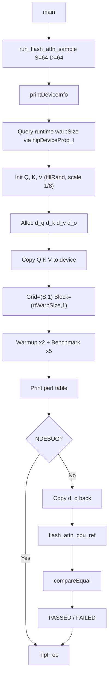
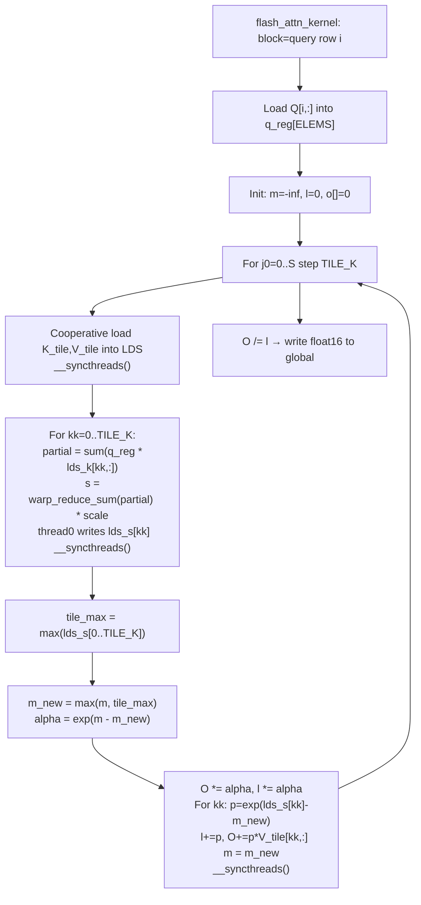

對，**這一段 code 跟 rocWMMA 的直接關聯其實不大**。更準確地說：

**它是「用 rocWMMA 的一些型別/常數/巨集」，但核心計算邏輯不是用 rocWMMA 的 WMMA/MFMA 路線。** 程式自己就在註解裡明講了：`Inner dot product` 是用 `warp-level reduction (__shfl_xor)`，而且 **`No rocWMMA MFMA is used inside the kernel`**。

你可以把它分成兩層看：

## 1. 有關聯的地方

這份 code 確實有用到 rocWMMA 的外圍元件，例如：

* `#include <rocwmma/rocwmma.hpp>`
* `using rocwmma::float16_t;`
* `using rocwmma::float32_t;`
* `rocwmma::Constants::AMDGCN_WAVE_SIZE_64/32`
* `ROCWMMA_DEVICE` 這類 macro / 型別包裝

所以它不是完全和 rocWMMA 無關，而是有點像：

**「借 rocWMMA 提供的 AMD 平台抽象與型別定義，來寫一個 FlashAttention sample。」** 

## 2. 沒有太大關聯的地方

但如果你問的是：

**「這支 kernel 的主要運算是不是建立在 rocWMMA fragment / load_matrix / mma_sync / MFMA pipeline 上？」**

答案就是：**不是。**

因為 kernel 裡真正做 score 計算的地方是：

1. 每個 thread 算自己那一小段 `partial`
2. 再用 `warp_reduce_sum(partial)`
3. 透過 `__shfl_xor` 做 wave/warp reduction
4. 然後進 online softmax 與 output accumulate 

也就是說，這份 code 的核心重點是：

* tiled K/V load 到 LDS
* warp-level dot product reduction
* online softmax
* output accumulation

而不是 rocWMMA 最擅長的那種：

* fragment abstraction
* matrix tile mapping
* MFMA instruction orchestration

## 3. 為什麼作者故意不用 rocWMMA MFMA

這份 sample 的註解也有講理由：
**如果用 rocWMMA MFMA，就要處理 architecture-specific fragment element layout，對 per-row softmax 這種流程會更複雜。** 所以作者刻意不用，讓這個 FlashAttention sample 比較好理解。

換句話說，這份 code 比較像是在教：

**FlashAttention 的 dataflow / online softmax / LDS tiling**

不是在教：

**rocWMMA 如何把 attention GEMM 映射到 matrix core/MFMA**

## 4. 一句話總結

如果你是從 rocWMMA 角度看：

* **弱相關**：有借用 rocWMMA 的型別、波前常數、裝置巨集
* **不屬於典型 rocWMMA kernel**：沒有 fragment、沒有 mma、沒有 MFMA 主路徑
* **本質上更像 HIP + LDS + shuffle reduction 的 FlashAttention 教學版**

## 5. 你可以怎麼判斷「是不是 rocWMMA 味很重」

如果是「rocWMMA 關聯很強」的 code，通常你會看到這類東西：

* `fragment<...>`
* `load_matrix_sync` 類似概念
* `mma_sync`
* 明確的 `M/N/K` tile mapping
* accumulator fragments
* LDS 到 fragment 的搬運設計

但這份 sample 幾乎沒有走那條路，它主要是：

* `q_reg[]`
* `lds_k / lds_v / lds_s`
* `warp_reduce_sum`
* `expf / fmaxf`
* online softmax 狀態 `m, l, o`

所以你的直覺是對的：**這份 code 和 rocWMMA 沒有太大核心耦合。**

| Key Point                            | Summary                                                         |
| ------------------------------------ | --------------------------------------------------------------- |
| Direct relationship                  | Low to moderate                                                 |
| Uses rocWMMA for                     | Types, constants, device macros                                 |
| Does not use rocWMMA for             | MFMA/WMMA core computation                                      |
| Actual compute style                 | HIP + LDS + `__shfl_xor` warp reduction                         |
| Main teaching goal                   | FlashAttention dataflow and online softmax                      |
| Not a typical rocWMMA sample because | No fragments, no `mma_sync`, no MFMA pipeline                   |
| Best description                     | A FlashAttention teaching sample with light rocWMMA scaffolding |

你如果要，我下一則可以直接幫你畫一張 **「這版 FlashAttention vs 典型 rocWMMA GEMM kernel」ASCII 對照圖**。

---
這份 `simple_flash_attn.cpp` 是一個**教學型、簡化版的 FlashAttention-1** 實作。它要算的是：

[
O = \text{Softmax}(QK^T/\sqrt{D})V
]

但和 naive SDPA 最大差別是：**它不會先把整個 (S \times S) attention score matrix 存出來**，而是把 `K/V` 分塊（tile）搬進 LDS，一塊一塊處理，並且用 **online softmax** 維持數值正確性。這也是這支 code 的核心。

---

# 1) 先看整體流程圖

## Host 端主流程 ASCII flow chart

```text
+------------------+
|      main()      |
+------------------+
          |
          v
+--------------------------------------+
| run_flash_attn_sample(SEQ_LEN, D)    |
+--------------------------------------+
          |
          v
+----------------------+
| printDeviceInfo()    |
| 顯示 GPU 資訊         |
+----------------------+
          |
          v
+------------------------------+
| 讀 runtime warpSize          |
| (host 端不能只信 compile-time)|
+------------------------------+
          |
          v
+------------------------------+
| 檢查尺寸是否合法              |
| seq % TILE_K == 0            |
| head % warpSize == 0         |
+------------------------------+
          |
      yes | no
          |--------------------+
          v                    |
+---------------------------+  |
| 計算 scale = 1/sqrt(head) |  |
+---------------------------+  |
          |                    |
          v                    |
+---------------------------+  |
| 計算 LDS bytes            |  |
+---------------------------+  |
          |                    |
          v                    |
+---------------------------+  |
| 建 host buffers: Q/K/V/O  |  |
| fillRand + 縮小數值範圍    |  |
+---------------------------+  |
          |                    |
          v                    |
+---------------------------+  |
| hipMalloc device buffers  |  |
| hipMemcpy H2D             |  |
+---------------------------+  |
          |                    |
          v                    |
+---------------------------+  |
| 設定 grid=(seq,1)         |  |
| block=(warpSize,1)        |  |
+---------------------------+  |
          |                    |
          v                    |
+---------------------------+  |
| warmup 幾次 kernel        |  |
+---------------------------+  |
          |                    |
          v                    |
+---------------------------+  |
| benchmark 幾次 kernel     |  |
| hipEvent 計時             |  |
+---------------------------+  |
          |                    |
          v                    |
+---------------------------+  |
| 計算 GFlops / TFlops      |  |
| 印出結果                  |  |
+---------------------------+  |
          |                    |
          v                    |
+-------------------------------+
| Debug 模式: CPU reference 驗證 |
+-------------------------------+
          |
          v
+---------------------------+
| hipFree / 結束            |
+---------------------------+
```

這個 host driver 的工作就是：**準備資料、決定 launch 參數、呼叫 kernel、量測效能、必要時驗證正確性**。`grid=(seq,1)` 代表 **每一個 query row 用一個 block 算**；`block=(warpSize,1)` 代表 **每個 block 就是一個 wave/warp**。

---

# 2) Kernel 內真正的演算法流程

## Kernel ASCII flow chart

```text
+--------------------------------------------------+
| flash_attn_kernel(...)                           |
| blockIdx.x = q_row                               |
| 一個 block 負責一列 Q[q_row, :]                  |
+--------------------------------------------------+
                     |
                     v
+--------------------------------------+
| 配置 LDS:                            |
| lds_k [tile_k * head]               |
| lds_v [tile_k * head]               |
| lds_s [tile_k]                      |
+--------------------------------------+
                     |
                     v
+--------------------------------------+
| 每個 thread 決定自己負責的 dim 區段    |
| d_start = tid * ELEMS_PER_THREAD     |
+--------------------------------------+
                     |
                     v
+--------------------------------------+
| 從 global memory 載入 Q[q_row,:]     |
| 到 thread-local q_reg[]              |
+--------------------------------------+
                     |
                     v
+--------------------------------------+
| 初始化 online softmax state          |
| m = -inf                             |
| l = 0                                |
| o[] = 0                              |
+--------------------------------------+
                     |
                     v
      +-------------------------------------------+
      | for j0 in [0, tile_k, 2*tile_k, ...]      |
      | 逐塊處理 K/V                              |
      +-------------------------------------------+
                     |
                     v
      +-------------------------------------------+
      | Phase 1: cooperative load                 |
      | 把 K tile / V tile 搬進 LDS               |
      +-------------------------------------------+
                     |
                     v
      +-------------------------------------------+
      | __syncthreads()                           |
      +-------------------------------------------+
                     |
                     v
      +-------------------------------------------+
      | Phase 2: 計算 tile 內每個 kk 的 score      |
      | partial = q_reg · lds_k[kk,: 的自己那段]  |
      | warp_reduce_sum(partial)                  |
      | 得到完整 dot                              |
      | lds_s[kk] = dot * scale                   |
      +-------------------------------------------+
                     |
                     v
      +-------------------------------------------+
      | __syncthreads()                           |
      +-------------------------------------------+
                     |
                     v
      +-------------------------------------------+
      | Phase 3: online softmax                   |
      | tile_max = max(lds_s)                     |
      | m_new = max(m, tile_max)                  |
      | alpha = exp(m - m_new)                    |
      | l *= alpha                                |
      | o *= alpha                                |
      |                                           |
      | 對每個 kk:                                |
      |   p_kk = exp(lds_s[kk] - m_new)           |
      |   l += p_kk                               |
      |   o += p_kk * V_tile[kk,:]                |
      |                                           |
      | m = m_new                                 |
      +-------------------------------------------+
                     |
                     v
      +-------------------------------------------+
      | __syncthreads()                           |
      | 準備覆寫 LDS 給下一個 tile                 |
      +-------------------------------------------+
                     |
                     v
+--------------------------------------+
| 全部 tile 完成後                     |
| inv_l = 1 / l                        |
| out[q_row,:] = o * inv_l             |
+--------------------------------------+
```

這就是整個 FlashAttention 精神：**不要存完整 attention matrix，而是邊掃 tile 邊更新 softmax 狀態與輸出**。

---

# 3) 這支 code 的重點區塊解釋

## A. compile-time constants 在幹嘛

這幾個常數定義了整個 sample 的形狀：

* `TILE_K = 16`：每次載入 16 列的 `K/V`
* `SEQ_LEN = 64`
* `HEAD_DIM = 64`
* `BLOCK_SIZE = WAVE_SIZE_CT`
* `ELEMS_PER_THREAD = HEAD_DIM / BLOCK_SIZE`

意思是：

* 如果是 **Wave32**，那 `64 / 32 = 2`，每個 thread 負責 2 個 head 維度元素
* 如果是 **Wave64**，那 `64 / 64 = 1`，每個 thread 負責 1 個元素

所以這個 kernel 的資料分工非常直觀：**把一整列 Q 的 head dimension 拆給整個 wave 的 threads 去處理**。

---

## B. 為什麼 host 端還要重新查 `warpSize`

這段很重要，也很值得注意。

程式註解特別說：`ROCWMMA_ARCH_GFX9` 是 **device compile only**，所以 host compile 時看到的 compile-time `BLOCK_SIZE` 不一定等於真實裝置的 wave size。於是 host 端又用：

* `hipGetDeviceProperties`
* `prop.warpSize`

去讀 **runtime warp size**，拿來決定：

* `blockDim`
* `rtElems`
* `lds_bytes`

這是為了避免 host 端 launch 參數和 device 端真正假設的 wave size 不一致。這點是這份 code 裡一個很關鍵的 correctness 細節。

---

## C. `warp_reduce_sum()` 做了什麼

```cpp
ROCWMMA_DEVICE inline float warp_reduce_sum(float val)
{
#pragma unroll
    for(int off = (int)(BLOCK_SIZE / 2); off > 0; off >>= 1)
        val += __shfl_xor(val, off);
    return val;
}
```

這是 warp / wave 內 reduction。

每個 thread 先算出自己那一小段 head-dim 的部分內積 `partial`，然後用 `__shfl_xor` 把整個 wave 的 partial sums 加總起來，得到完整的：

[
Q[i,:] \cdot K[j,:]
]

所以這邊其實是在做：

1. thread-local partial dot
2. wave-level reduction
3. 得到完整 score

這也是為什麼作者說 **沒有用 rocWMMA MFMA**。雖然 include 了 rocWMMA 型別，但 kernel 本體採用的是比較直接、容易理解的 wave reduction 寫法。

---

## D. `flash_attn_kernel()` 的 mapping

這個 kernel 的 mapping 很清楚：

* `blockIdx.x = q_row`
* 一個 block 負責一整列 query
* 一個 block 只有一個 warp/wave
* 每個 thread 負責該 query row 裡的一小段 `head dimension`

也就是說：

* **sequence 維度**：用 block 去切
* **head 維度**：用 wave 內 threads 去切

這種 mapping 很適合這種小尺寸、教學 sample，也能讓 online softmax 狀態維持得很單純。

---

## E. shared memory / LDS 佈局

LDS 只放三種東西：

* `lds_k`: 一塊 K tile
* `lds_v`: 一塊 V tile
* `lds_s`: 這塊 tile 裡每一列 K 對應的 score

```text
smem
├─ lds_k : [tile_k * head]
├─ lds_v : [tile_k * head]
└─ lds_s : [tile_k]
```

這代表它的 memory usage 是：

[
O(tile_k \cdot head)
]

而不是 naive attention 那種：

[
O(seq^2)
]

這正是 FlashAttention 的核心優勢之一。

---

## F. Phase 1：為什麼先把 K/V 搬進 LDS

在這段：

```cpp
for(uint32_t e = threadIdx.x; e < tile_elems; e += blockDim.x)
```

整個 block 共同把目前 tile 的 K 和 V 搬進 LDS。這樣做的目的：

1. 後面要重複讀這一塊 K/V
2. 放在 LDS 比直接從 global memory 讀更快
3. 同一個 block 裡所有 thread 都會共享這些資料

也就是：**global -> LDS -> reuse**。

---

## G. Phase 2：score 是怎麼算的

對 tile 中每個 `kk`：

1. 每個 thread 對自己的 head slice 算 partial dot
2. `warp_reduce_sum(partial)`
3. 乘上 `scale = 1/sqrt(head)`
4. thread 0 把結果寫到 `lds_s[kk]`

所以 `lds_s[kk]` 存的是：

[
s_{kk} = Q[q_row] \cdot K[j0+kk] / \sqrt{D}
]

注意這裡**沒有把整個 score matrix 存到 global memory**，只把「目前 tile 的這 16 個 score」暫時存到 LDS。

---

## H. Phase 3：online softmax 是這份 code 最重要的地方

這份 code 的數學核心是這組更新：

* `m`：目前看過所有 tile 後的最大 score
* `l`：目前 softmax denominator 的累積值
* `o`：目前還沒除以 `l` 的輸出累積值

當新 tile 進來時，因為可能出現更大的 score，舊的累積結果必須重新 rescale：

[
m_{\text{new}} = \max(m, \max(S_j))
]

[
\alpha = e^{m - m_{\text{new}}}
]

[
l \leftarrow l \cdot \alpha
]

[
o \leftarrow o \cdot \alpha
]

然後再把新 tile 的 contribution 加進來：

[
p_{kk} = e^{s_{kk} - m_{\text{new}}}
]

[
l \leftarrow l + p_{kk}
]

[
o \leftarrow o + p_{kk} V_{kk}
]

最後全部 tile 掃完，再做：

[
O = o / l
]

這就是為什麼 FlashAttention 可以**不存完整 softmax matrix，卻仍然得到正確結果**。

---

## I. 為什麼 `o` 是 per-thread 陣列，而 `m/l` 是 warp-uniform

這邊設計很漂亮：

* `m` 和 `l`：對同一個 query row 而言，所有 threads 都應該一樣，所以是 **warp-uniform**
* `o[e]`：每個 thread 只負責自己那幾個 output 維度，所以是 **per-thread partial output**

也就是：

* softmax 的「統計量」是共享的
* output vector 的「維度切片」是 thread 分工的

這讓計算與資料分配非常自然。

---

## J. CPU reference 在幹嘛

`flash_attn_cpu_ref()` 不是 naive 全矩陣版本，而是**用同樣 online softmax 演算法的 CPU 版本**。

這很重要，因為它不是拿不同演算法對比，而是拿**相同邏輯的高精度版本**來驗證 GPU kernel 是否正確。這樣比較更公平，也更容易定位誤差來源。

---

## K. benchmark 段落在幹嘛

host 端會：

1. warmup 2 次
2. record 5 次
3. 用 `hipEvent` 量測總時間
4. 用公式估 FLOPs

它把 attention 粗略視為兩個 GEMM：

* (QK^T)
* (AV)

所以 FLOPs 用：

[
4 \cdot S \cdot S \cdot D
]

這是很常見的簡化估法，用來看大致 throughput。

---

# 4) 你看這份 code 時，最該抓住的 5 個觀念

## (1) 它不是完整高性能版 FlashAttention

這是 **簡化教學版**，重點是演算法與 dataflow，不是極限性能。

## (2) 真正避免爆 memory 的關鍵

不是什麼神奇指令，而是：

* `K/V` 分 tile
* score 不 materialize 成完整矩陣
* 用 online softmax 維持正確性

## (3) 一個 block 對應一個 query row

這讓 softmax state `m/l` 很好維護。

## (4) rocWMMA 被 include，但 kernel 沒用 MFMA

這點很值得注意：**這支 sample 主要是在教 FlashAttention dataflow，不是在教 rocWMMA tensor core/matrix core programming**。

## (5) host/runtime warp size 的處理是 correctness 關鍵

這是 AMD 平台上很容易忽略但很重要的一點。

---

# 5) 你可以把這支 code mentally 拆成一句話

**每個 block 固定處理一個 Q row，反覆把 K/V 小塊搬進 LDS，對每塊算分數、更新 online softmax、累加輸出，最後再 normalize 寫回。**

---

# 6) 如果你要繼續往下分析，下一步最值得看的是什麼

下一步最值得拆的是這三件事：

1. **每個 thread 的資料 ownership**

   * `d_start`
   * `ELEMS_PER_THREAD`
   * Wave32 / Wave64 差異

2. **online softmax 數學推導**

   * 為什麼 rescale 舊 `o/l` 是正確的

3. **這版和真正高性能 FlashAttention / rocWMMA 版的差異**

   * 為什麼這版可讀性高，但效能通常不會最好

---
```text
FlashAttention sample (this code)
================================

        Global Memory
   +----------------------+
   |   Q    K    V    O    |
   +----------------------+
      |    |    |
      |    |    +----------------------+
      |    +-----------+               |
      |                |               |
      v                v               v

+--------------------------------------------------+
| One block = one Q row                            |
| blockIdx.x = q_row                               |
| blockDim = warpSize                              |
+--------------------------------------------------+
                     |
                     v
        +---------------------------+
        | load Q row -> q_reg[]     |
        | (thread-local registers)  |
        +---------------------------+
                     |
                     v
      +------------------------------------------+
      | loop over K/V tiles (j0 = 0, 16, 32...)  |
      +------------------------------------------+
                     |
                     v
        +-------------------------------+
        | load K tile -> LDS (lds_k)    |
        | load V tile -> LDS (lds_v)    |
        +-------------------------------+
                     |
                     v
        +-------------------------------+
        | partial dot per thread        |
        | q_reg · lds_k slice           |
        +-------------------------------+
                     |
                     v
        +-------------------------------+
        | warp_reduce_sum(__shfl_xor)   |
        | => full score for each kk     |
        +-------------------------------+
                     |
                     v
        +-------------------------------+
        | online softmax update         |
        | m, l, o                       |
        +-------------------------------+
                     |
                     v
        +-------------------------------+
        | accumulate output with V tile |
        +-------------------------------+
                     |
                     v
        +-------------------------------+
        | next K/V tile                 |
        +-------------------------------+
                     |
                     v
        +-------------------------------+
        | normalize o / l               |
        | write O[q_row, :]             |
        +-------------------------------+


Typical rocWMMA GEMM kernel
===========================

        Global Memory
   +----------------------+
   |      A      B      C  |
   +----------------------+
          |      |
          v      v

+--------------------------------------------------+
| One block handles one matrix tile                |
| e.g. C[M_tile, N_tile]                           |
+--------------------------------------------------+
                     |
                     v
        +-------------------------------+
        | load A/B tile to LDS          |
        +-------------------------------+
                     |
                     v
        +-------------------------------+
        | move LDS data into fragments  |
        | matrix_a / matrix_b           |
        +-------------------------------+
                     |
                     v
        +-------------------------------+
        | mma_sync / MFMA               |
        | accumulate into acc fragment  |
        +-------------------------------+
                     |
                     v
        +-------------------------------+
        | loop over K dimension tiles   |
        +-------------------------------+
                     |
                     v
        +-------------------------------+
        | store acc fragment -> C tile  |
        +-------------------------------+


Main difference
===============

This FlashAttention sample:
  Q row fixed
  -> scan K/V tiles
  -> compute scores
  -> do online softmax
  -> accumulate output

Typical rocWMMA kernel:
  C tile fixed
  -> scan A/B tiles along K
  -> fragment load
  -> MFMA / mma_sync
  -> accumulate tile result
```

## 差異解釋

這兩者最大的差別不是「都有沒有用 LDS」，而是 **演算法中心不同**。

### 這份 FlashAttention sample 的中心

中心是：

* 一個 block 固定處理一個 `Q row`
* 逐塊掃過 `K/V`
* 每塊先算 score
* 然後做 **online softmax**
* 再把 `V` 加權累加到 output

所以它的主軸是：

**attention row reduction + softmax state update**

不是一般矩陣乘法那種 tile accumulate。

---

### 典型 rocWMMA kernel 的中心

典型 rocWMMA / WMMA kernel 的中心是：

* 固定一塊 `C tile`
* 沿著 K 維度不斷載入 `A/B tile`
* 搬進 fragment
* 呼叫 `mma_sync` / MFMA
* 把 accumulator fragment 一直累加
* 最後寫回 `C`

所以它的主軸是：

**matrix tile multiply-accumulate**

---

## 為什麼這份 code 不算 rocWMMA 味很重

因為你在這份 code 裡看不到典型 rocWMMA 主體：

* 沒有 fragment 主流程
* 沒有 `mma_sync`
* 沒有用 MFMA 做主內核
* 沒有 accumulator fragment 的 tile pipeline

反而看到的是：

* `q_reg[]`
* `lds_k / lds_v / lds_s`
* `warp_reduce_sum`
* `expf / fmaxf`
* running `m / l / o`

所以這份 code 更接近：

**HIP kernel + LDS tiling + warp shuffle reduction + online softmax**

而不是：

**rocWMMA GEMM kernel**

---

## 一個直觀比喻

### FlashAttention sample

像是：

* 我拿著一列 query
* 一批一批看 key/value
* 每看一批就更新「目前 softmax 的統計」
* 最後得到這一列的輸出

### rocWMMA GEMM

像是：

* 我負責一塊 output matrix
* 一批一批把 A/B 小塊乘起來
* 一直累加
* 最後得到這塊 tile

---

## 結論

你的判斷是對的：

**這份 code 和 rocWMMA 只有外圍關聯，沒有核心演算法耦合。**

它比較像：

* 用 rocWMMA 的型別/巨集當 AMD 平台輔助
* 但核心其實是在示範 FlashAttention 的 dataflow

不是在示範 rocWMMA 的 matrix core programming。

| Topic              | FlashAttention sample                 | Typical rocWMMA kernel |
| ------------------ | ------------------------------------- | ---------------------- |
| Main goal          | Attention row computation             | Matrix tile GEMM       |
| Core compute       | Dot + warp reduction + online softmax | MFMA / mma_sync        |
| Work unit          | One Q row per block                   | One C tile per block   |
| Key state          | `m`, `l`, `o`                         | accumulator fragments  |
| Memory use         | K/V tiles in LDS                      | A/B tiles in LDS       |
| rocWMMA dependence | Light                                 | Heavy                  |
| Fragment usage     | No                                    | Yes                    |
| MFMA usage         | No                                    | Yes                    |
| Best description   | HIP FlashAttention teaching sample    | rocWMMA GEMM kernel    |

下一步如果你想更深入，我建議直接拆：
**「如果真的要把這份 FlashAttention 改寫成 rocWMMA 風格，困難點會卡在哪」**。

---

可以，這題的關鍵結論是：

**如果真的把這份 sample 改成 rocWMMA 風格，最難的不是「把 dot product 換成 MFMA」；最難的是要把整個 attention 的資料流，從「row-centric + online softmax」重塑成「tile-centric + fragment-centric」。**

而這份 code 目前明確是：

* 一個 block 對一個 `Q row`
* 一個 block 只有一個 wave
* 每個 thread 持有自己那段 head-dim
* score 用 `warp_reduce_sum(__shfl_xor)` 算
* 每個 KV tile 都更新一次 `m / l / o` online softmax state 

這種設計，和典型 rocWMMA 的思維其實差很多。

---

# 先看「現在這版」vs「假設改成 rocWMMA 版」

```text id="9ul9cu"
Current sample
==============

Q row fixed
   |
   v
load q_reg[]
   |
   v
for each KV tile:
    load K/V -> LDS
    dot(Q_row, K_tile_row) by warp reduction
    score -> lds_s[]
    online softmax update: m, l
    accumulate o[e] with V
   |
   v
normalize and write O[row,:]


Hypothetical rocWMMA-style version
==================================

Q/K/V tiled as matrix tiles
   |
   v
load tiles -> LDS
   |
   v
move tile data into fragments
   |
   v
MFMA for Q x K^T  ---> partial score tile
   |
   v
[hard part]
per-row max / exp / norm / online correction
   |
   v
repackage weights / probabilities
   |
   v
MFMA or vector-FMA with V tile
   |
   v
merge running states and write back
```

---

# 最難卡的 6 個地方

## 1) work decomposition 根本不同

現在這份 code 是 **row-centric**：

* `blockIdx.x = q_row`
* 一個 block 只處理一列 query
* `m`、`l` 是這一列的 running softmax 狀態
* `o[e]` 是這一列 output 的部分維度累積 

但 rocWMMA 最自然的拆法通常是 **tile-centric**：

* 一個 block / wave 處理一塊 matrix tile
* accumulator 是 tile，不是單一 row 的 running state

所以第一個衝突就是：

**FlashAttention 這版把「row」當主體；rocWMMA 把「tile」當主體。**

這不是換一個 intrinsic 而已，是整個 ownership 要重切。

---

## 2) online softmax 卡在兩段 GEMM 中間

attention 不是單純一個 GEMM：

[
QK^T \rightarrow softmax \rightarrow PV
]

rocWMMA/MFMA 最擅長的是這種：

[
C += A \times B
]

但 FlashAttention 的中間有一個非常不 matrix-core-friendly 的步驟：

* 要先拿 score 做 **per-row max**
* 再做 `exp`
* 再更新 running `m`
* 再 rescale 舊的 `l`
* 再 rescale 舊的 `o`
* 再把新 tile 的 contribution 加進去 

也就是說，即使你把 `QK^T` 那一段用 MFMA 加速了，**中間還是得掉回 scalar / vector 層級處理 softmax state**。

所以 attention kernel 很少是「純 rocWMMA kernel」；通常會是：

* 部分 GEMM-like 區段吃 tensor core
* 但 softmax / mask / rescale / reduction 還是另外處理

---

## 3) fragment layout 不適合直接做 per-row softmax

這份 sample 的註解其實已經把原因講出來了：

> 沒有在 kernel 裡用 rocWMMA MFMA，因為不想處理 architecture-specific fragment element layout，特別是 per-row softmax 這種流程。 

這句話非常關鍵。

因為 rocWMMA fragment 裡的元素分布，對你來說不是天然「一整列連續排好」的直觀形式。
但 softmax 需要的正是：

* 這一列的 max
* 這一列的 sum
* 這一列每個 score 對應的 exp
* 這一列對 V 的加權

也就是說：

**MFMA 很擅長算 tile accumulate，但 softmax 想要的是 row semantics。**

所以你會遇到一個煩人的問題：

* MFMA 算完了，但你還得把 fragment 裡的結果重新整理成 row-wise 可操作格式

這會帶來：

* 額外 LDS 搬運
* 額外 register shuffle
* 額外 layout transform

---

## 4) `P * V` 這段也沒你想像中那麼適合直接 rocWMMA 化

直覺上你可能會想：

* 前半段 `QK^T` 可 MFMA
* 後半段 `P*V` 也可 MFMA

但問題是 `P` 並不是一個乾淨、完整 materialized 的矩陣。
在這份 code 裡，`P` 是每個 tile 算完 `lds_s[kk]` 後，立刻經過：

* `m_new`
* `alpha`
* `p_kk = expf(...)`
* 更新 `l`
* 更新 `o[e] += p_kk * V[...]` 

也就是 `P` 在這裡是**短命的、online 的、逐 tile 消費掉的權重**，不是一塊可以舒服餵進 fragment 的靜態矩陣。

所以如果你硬要把 `P*V` 也做成 rocWMMA 路線，通常要先回答：

* `P` 要不要顯式 materialize？
* materialize 到 LDS 還是 registers？
* 做完 softmax correction 後，怎麼排成 matrix-core-friendly 的 tile？

這些步驟可能會把原本省 IO 的好處吃掉。

---

## 5) 這份 sample 的 tile shape 太小、太教學向

這份 code 的預設是：

* `SEQ_LEN = 64`
* `HEAD_DIM = 64`
* `TILE_K = 16`
* 一個 block 就一個 wave 

這種尺寸很適合拿來教：

* LDS 怎麼放
* online softmax 怎麼更新
* warp reduction 怎麼做

但對 rocWMMA 來說，真正要漂亮吃滿，通常會希望：

* 更明確的 tile mapping
* 更大的 M/N/K blocking
* 多 wave 協作
* 更精細的 LDS double buffering
* 更穩定的 fragment reuse

所以你如果硬把這個 sample 改成 rocWMMA 版，第一個感覺很可能不是「突然超快」，而是：

**程式複雜度暴增，但因為 problem 太小，性能紅利未必漂亮。**

---

## 6) wave32 / wave64 與 fragment shape 會讓可攜性更麻煩

這份 sample 現在很簡單：

* `ELEMS_PER_THREAD = HEAD_DIM / BLOCK_SIZE`
* gfx9 wave64 時每 thread 1 個元素
* gfx11/gfx12 wave32 時每 thread 2 個元素 

這種寫法很直觀。

但如果改成 rocWMMA 路線，你會開始在意：

* 某架構支援哪些 MFMA shape
* fragment 在 wave32 / wave64 下怎麼映射
* 你的 softmax row ownership 要怎麼對齊 fragment lane mapping
* 同一份 kernel 要不要分架構特化

所以 sample 作者才會明說：
這支教學版故意不碰那塊。

---

# 真正可行的方向通常不是「全改」，而是「混合式」

比較務實的做法通常長這樣：

```text id="l29jw1"
Hybrid direction
================

Phase A: Q x K^T
   -> 用 rocWMMA / MFMA 算 score tile

Phase B: Softmax
   -> row-wise max/sum/exp/online correction
   -> 用 scalar/vector path 做

Phase C: P x V
   -> 視 tile 形狀決定
      - 小 tile: vector-FMA / LDS reuse
      - 大 tile: 再考慮 rocWMMA
```

也就是：

**不要執著整個 kernel 都 rocWMMA 化。**
真正工程上常見的是「能 matrix-core 的地方吃 matrix-core，不能的地方保持 row-wise pipeline」。

---

# 如果你真的要改，最實際的改法順序

## 第一步：只改 `QK^T` score 計算

先把現在這段：

* `partial += q_reg[e] * lds_k[...]`
* `warp_reduce_sum(partial)`

替換成「小 tile 的 matrix multiply」思維。
先只看 score tile 能不能用 rocWMMA 算出來，再把結果存到 LDS。

這一步最容易看出值不值得。

## 第二步：softmax 還是先保留原本 row-wise

也就是：

* `lds_s[]` 還是當 score buffer
* `tile_max`
* `m_new`
* `alpha`
* `l`
* `o`

這套先不動。

## 第三步：再評估 `P*V` 值不值得 matrix-core 化

很多時候這一步不一定值得。
因為你已經在 phase B 做了很多 row-wise scalar work，`P` 未必值得重新排版成 fragment 友善形式。

---

# 一句話版本

**把這份 code 改成 rocWMMA 風格，真正的難點不是乘法本身，而是 softmax 的 row-wise online 狀態管理，和 rocWMMA 的 tile/fragment 世界觀天生不對齊。**

---

# 我對這份 code 的工程判斷

如果你的目標是：

### 1. 教學 / 理解 FlashAttention

現在這版其實很好。
因為它把核心概念露得很清楚：`lds_k / lds_v / lds_s / m / l / o`。

### 2. 研究 rocWMMA 能不能介入 attention

可以，但我會建議：

* **先做 hybrid prototype**
* 不要一開始就追求 full rocWMMA FlashAttention

### 3. 追高性能 production kernel

那通常不會是單純把這個 sample 改寫完就結束。
還要一起考慮：

* block 多 wave 協作
* double buffering
* mask/causal
* vectorized load/store
* register pressure
* occupancy
* arch-specific MFMA shape

---

| Key Point                              | Summary                                                                                                       |
| -------------------------------------- | ------------------------------------------------------------------------------------------------------------- |
| Main mismatch                          | Current code is **row-centric**, rocWMMA is usually **tile-centric**                                          |
| Hardest part                           | Not the dot product itself, but **online softmax state management**                                           |
| Why MFMA was avoided                   | The file explicitly says it avoids architecture-specific fragment layout issues for per-row softmax           |
| Current kernel style                   | One block per query row, one wave per block, warp reduction for scores, row-wise running `m/l/o`              |
| Why `QK^T` is easier than full rewrite | Score computation can be GEMM-like, but softmax breaks the pure matrix-multiply flow                          |
| Why `P*V` is still hard                | `P` is online and short-lived, not a nicely materialized matrix tile                                          |
| Practical strategy                     | Use a **hybrid design**: MFMA for score tiles, scalar/vector path for softmax, then evaluate `P*V` separately |
| Best use of this sample                | Great for learning FlashAttention dataflow, not as a direct full rocWMMA template                             |

下一則我可以直接幫你畫一張 **「如果只把 `QK^T` 這半段改成 rocWMMA，kernel 會怎麼重構」的 ASCII flow chart**。


## Keypoints / Summary

| Topic                      | Summary                                                                                |
| -------------------------- | -------------------------------------------------------------------------------------- |
| Core formula               | Computes `O = Softmax(QK^T / sqrt(D)) V`                                               |
| Main idea                  | Does **not** materialize the full `S x S` score matrix                                 |
| Memory strategy            | Loads `K/V` by tiles into LDS and reuses them                                          |
| Block mapping              | One block handles one query row                                                        |
| Thread mapping             | Threads split the head-dimension work                                                  |
| Reduction method           | Uses warp-level `__shfl_xor` reduction for dot products                                |
| Softmax method             | Uses **online softmax** with running `m`, `l`, and `o`                                 |
| LDS contents               | `lds_k`, `lds_v`, `lds_s`                                                              |
| Why faster in memory sense | Memory scales like `O(TILE_K * D)`, not `O(S^2)`                                       |
| rocWMMA usage              | rocWMMA types are included, but **MFMA is not used in the kernel**                     |
| Host-side caveat           | Host must use **runtime warpSize**, not only compile-time constants                    |
| CPU reference              | Uses the same online-softmax logic for validation                                      |
| Benchmark model            | FLOPs estimated as two GEMMs: `QK^T` and `AV`                                          |
| Best mental model          | “One Q row per block, scan K/V tiles, update online softmax, write normalized output.” |


---
# simple_flash_attn — Flash Attention (Tiled SDPA)

## Overview

Implements **FlashAttention-1 Algorithm 1** — memory-efficient attention without materializing the full `S×S` score matrix:

```
O = Softmax( Q * K^T / sqrt(D) ) * V
```

**Key difference from `simple_sdpa.cpp`**:
`simple_sdpa` computes all `S×S` scores before softmax (3 separate kernel passes).
`simple_flash_attn` processes K/V in tiles of `TILE_K` rows, streaming through them once,
maintaining running statistics in registers — **no global S×S intermediate**.

---

## Online Softmax Algorithm (FlashAttention-1, Algorithm 1)

For each query row `i`, iterate over KV tiles `j`:

```
m = -inf,  l = 0,  O[i,:] = 0

For each tile j (j0 = 0, TILE_K, 2*TILE_K, ...):
    S[j] = Q[i,:] . K[j0..j0+TILE_K, :]^T / sqrt(D)   <- dot products
    tile_max = max(S[j])
    m_new    = max(m, tile_max)
    alpha    = exp(m - m_new)                            <- rescale old state
    O[i,:]   = alpha * O[i,:] + sum_k exp(S[k]-m_new) * V[j0+k,:]
    l        = alpha * l      + sum_k exp(S[k]-m_new)
    m        = m_new

O[i,:] /= l                                             <- normalize once
```

This is numerically stable (subtract running max) and processes each KV element exactly once.

---

## Kernel Design

```
Grid : (S, 1)              one block per query row
Block: (BLOCK_SIZE, 1)     one warp (WAVE_SIZE = 32 for gfx12, 64 for gfx9)
```

**Thread mapping** — each thread owns `ELEMS_PER_THREAD = HEAD_DIM / BLOCK_SIZE` contiguous dims:

| Architecture | WAVE_SIZE | ELEMS\_PER\_THREAD (D=64) |
|---|---|---|
| gfx12 (RDNA4, Wave32) | 32 | 2 |
| gfx9  (CDNA, Wave64)  | 64 | 1 |

**Warp-level dot product** — thread `t` computes partial sum over its owned dims, then `__shfl_xor` reduction:

```cpp
for (off = WAVE_SIZE/2; off > 0; off >>= 1)
    val += __shfl_xor(val, off);
```

---

## Shared Memory Layout

`~8 KB` per block — well within 64 KB limit:

```
float lds_k[TILE_K * HEAD_DIM]   4096 bytes   K tile (float32)
float lds_v[TILE_K * HEAD_DIM]   4096 bytes   V tile (float32)
float lds_s[TILE_K]                64 bytes   dot-product scores
```

Synchronization pattern per KV tile (3 `__syncthreads()`):
1. After cooperative K,V load → before dot product reads LDS
2. After thread-0 writes scores to `lds_s` → before all threads read it
3. After output update → before next K,V load overwrites LDS

---

## Memory Comparison vs simple\_sdpa

| Resource | simple\_sdpa | simple\_flash\_attn |
|---|---|---|
| Score matrix | `S×S float32` global (16 KB for S=64) | Never allocated |
| Attention weights | `S×S float16` global (8 KB for S=64) | Never allocated |
| LDS per block | 0 | ~8 KB |
| Kernel count | 3 (QK, SM, AV) | 1 |
| Global memory saved | — | `S² × 6 bytes` |

---

## Architecture Compatibility

| Architecture | Wave size | Status |
|---|---|---|
| gfx9 (MI200/MI300) | 64 | **Verified PASSED** (gfx942 / MI300X) |
| gfx11 (RDNA3) | 32 | Supported |
| gfx12 (RDNA4, gfx1201) | 32 | **Verified PASSED** (RX 9070) |

> [!IMPORTANT]
> `ROCWMMA_ARCH_GFX9` is **device-compile-only** (see `config.hpp` line 48).
> During host compilation `ROCWMMA_ARCH_HOST=1` and all arch macros = 0.
> The compile-time `BLOCK_SIZE` / `ELEMS_PER_THREAD` are only correct in
> device code. Host launch config uses runtime `hipDeviceProp_t::warpSize`.

---

## File Structure

```
simple_flash_attn.cpp   - kernel + host driver
simple_flash_attn.md    - this document
```

---

## Building & Running

```bash
cmake --build . --target simple_flash_attn
./samples/simple_flash_attn
```

---

## Program Flow



---

## Kernel Flow



---

## Validated Output (gfx1201 / AMD RX 9070)

```
Flash Attention: S=64  D=64  TILE_K=16  BLOCK_SIZE=32  ELEMS=2  scale=0.125
LDS per block: 8256 bytes
grid=(64,1)  block=(32,1)

S         D         TILE_K    elapsedMs     GFlops        TFlops/s
64        64        16        0.231125      0.00104858    0.0226842

Validating against CPU reference (same online softmax algorithm)...
PASSED!
Max relative error: 0
```

## Validated Output (gfx942 / AMD Instinct MI300X)

```
Flash Attention: S=64  D=64  TILE_K=16  BLOCK_SIZE=64  ELEMS=1  scale=0.125
LDS per block: 8256 bytes
grid=(64,1)  block=(64,1)

S         D         TILE_K    elapsedMs     GFlops        TFlops/s
64        64        16        0.203146      0.00104858    0.0258084

Validating against CPU reference (same online softmax algorithm)...
PASSED!
Max relative error: 0
```

> **Note**: `Max relative error: 0` because the GPU kernel and CPU reference implement the *exact same* online softmax algorithm with the same floating-point operations in the same order.

---

## Bug Fix: Host/Device Compilation Mismatch

### Symptom

| GPU | `BLOCK_SIZE` shown | block dim launched | Result |
|---|---|---|---|
| RX 9070 (gfx1201, Wave32) | 32 | (32,1) | PASSED |
| MI300X (gfx942, Wave64) | 32 | (32,1) | **FAILED** (error ~0.22) |

On MI300X the kernel computed wrong attention scores, with a consistent ~22% relative error.

### Root Cause

rocWMMA's arch macros are **device-compile-only** (`config.hpp` line 48-52):

```cpp
// __gfx942__ is exclusively defined during the device compiler pass
#if defined(__gfx942__) && ROCWMMA_DEVICE_COMPILE
#define ROCWMMA_ARCH_GFX942 __gfx942__
```

HIP compiles each `.cpp` file **twice**: once for host (x86) and once for device (AMDGCN).
During the host pass, `ROCWMMA_ARCH_GFX9 = 0` and `ROCWMMA_ARCH_HOST = 1`.

The original code used compile-time `BLOCK_SIZE` for the host launch config:

```cpp
// Host always sees: ROCWMMA_ARCH_GFX9=0 -> WAVE_SIZE_CT=32 -> BLOCK_SIZE=32
dim3 blockDim(BLOCK_SIZE, 1);   // <-- always 32 on host!
```

| Compilation pass | `ROCWMMA_ARCH_GFX9` | `BLOCK_SIZE` | `ELEMS_PER_THREAD` |
|---|---|---|---|
| HOST (x86) | 0 | 32 | 2 |
| DEVICE (gfx942) | 1 | **64** | **1** |
| DEVICE (gfx1201) | 0 | 32 | 2 |

On gfx1201: host=32, device=32 -> **match** -> PASSED.
On gfx942: host=32, device=64 -> **mismatch** -> each thread expects 1 elem but only 32 of 64 threads run -> half the head dims uncomputed -> FAILED.

### Fix

Host code now queries runtime `hipDeviceProp_t::warpSize` and uses it for:
- `dim3 blockDim(rtWarpSize, 1)` -- launch configuration
- Divisibility check (`head % rtWarpSize`)
- Printed diagnostics

Device code keeps using `ROCWMMA_ARCH_GFX9` compile-time constants (correct in device pass).

```diff
+    hipDeviceProp_t prop;
+    hipGetDeviceProperties(&prop, dev);
+    uint32_t rtWarpSize = prop.warpSize;    // 32 or 64
     ...
-    dim3 blockDim(BLOCK_SIZE, 1);           // always 32 on host
+    dim3 blockDim(rtWarpSize, 1);           // matches device BLOCK_SIZE
```

### Lesson

> [!CAUTION]
> Never use `ROCWMMA_ARCH_*` macros in **host** code for values that must
> match the device side (block size, elements per thread, LDS layout).
> Use `hipDeviceProp_t::warpSize` at runtime instead.

---

## Reference

Dao et al., *FlashAttention: Fast and Memory-Efficient Exact Attention with IO-Awareness*, NeurIPS 2022. Algorithm 1.
