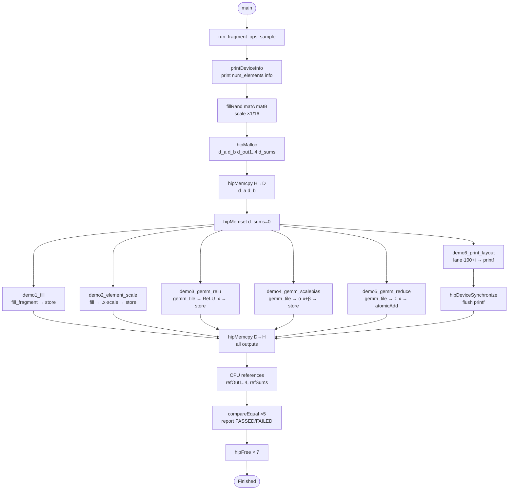
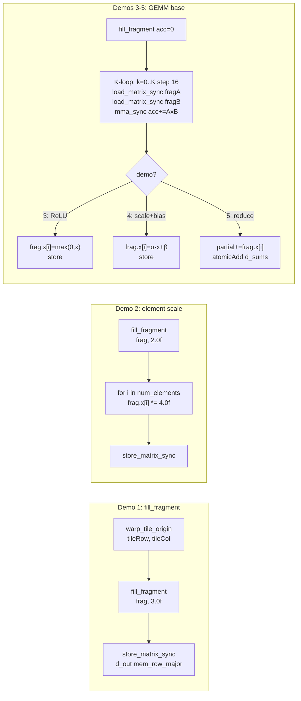

我會說：**適合當「rocWMMA 入門中的 fragment 教學範例」**，但**不太適合直接當成「完整 rocWMMA 教學範例」的唯一代表**。

原因很直接。

這份程式的定位其實寫得很清楚，它的目的是教 **fundamental rocWMMA fragment APIs**，而且是針對「在做 fused LLM operator kernel 之前先理解 fragment」這一層。它把重點放在 `fill_fragment`、`frag.x[i]`、`frag.num_elements`、`load_matrix_sync`、`mma_sync`、`store_matrix_sync`，再加上幾個 element-wise / reduce 範例，這個切分方式其實很適合初學者先建立 mental model。

尤其有幾個地方做得不錯：

第一，它有先講 **fragment ownership**。像 16×16 tile 一共 256 個元素，wave64 每 thread 持有 4 個、wave32 每 thread 持有 8 個，這對 rocWMMA 新手非常重要，因為很多人第一次看 `frag.x[]` 會誤以為那是整塊 tile 的線性展開，其實不是。這份範例有先把這件事講出來，方向是對的。

第二，它把 demo 切成 6 個小段：constant fill、element-wise scale、GEMM+ReLU、GEMM+scale+bias、GEMM+reduce、print layout。這種教學節奏很好，因為讀者可以先知道「fragment 不只是拿來做 `mma_sync`，也可以在 accumulator 上直接做 per-element 後處理」。這很貼近你前面一直在看的 fused op 思路。

第三，它有 **CPU reference validation**，不是只跑 kernel 而已。對教學很重要，因為學生可以先建立「這個 API 怎麼用」而不是一開始就陷進效能細節。

但如果你問我「能不能當 rocWMMA 教學範例」，我會加一個很大的限定：

## 它比較像「fragment 操作教材」，不是「rocWMMA kernel 設計教材」

它的 launch config 幾乎固定成 **one block = one warp = one tile**，這樣非常容易懂，但也因此把真實 rocWMMA kernel 裡更重要的東西全部抽掉了：沒有 LDS staging、沒有 cooperative load、沒有 double buffering、沒有 block-level tiling、沒有 wave 之間的分工、也沒有講 register pressure / occupancy / memory throughput。

所以如果有人看完這份就以為「rocWMMA 大概就是這樣」，那會有點危險。
因為真正在寫高效 kernel 時，`mma_sync` 本身通常不是最難的部分；最難的通常是：

* 資料怎麼搬進來
* LDS 怎麼排
* wave/block 怎麼切 tile
* 怎麼 hide memory latency
* 怎麼把 epilogue / reduce / norm / activation 做 fusion

而這份範例幾乎都沒有碰到。

## 它有幾個教學上的優點，也有幾個容易誤導的點

### 優點

它明確示範了 `frag.x[i]` 與 `frag.num_elements` 的用法，還特別做了 print layout，這很適合第一次理解 fragment 不是普通 array 這件事。

### 容易誤導的點

`demo5_gemm_reduce` 用 `atomicAdd` 做 tile sum，而且註解也說了 production 應該改成 warp-shuffle reduction。這表示它是**教概念**沒錯，但如果你把它當成「最佳實踐」，那就不對了。

另外，B matrix 用 `col_major`，雖然這在 WMMA/rocWMMA 世界很常見，但對剛入門的人很容易卡住，尤其 CPU reference 那邊又要自己對照 `b[j * k + h]`。這種 layout 轉換如果沒有再補一張圖，學習成本會偏高。

還有一點很重要：檔案裡有講 `(thread, element_index) -> (row, col)` 的 mapping 是 **architecture-dependent**，由 rocWMMA 內部管理。這句是正確的，但如果拿來教學，最好再補一句：「所以不要自己假設 `frag.x[0]` 對應 tile 左上角某個固定元素」。不然很多人會在這裡踩坑。

## 我的結論

### 很適合的用途

拿來當：

* rocWMMA 第 1 份或第 2 份教材
* fragment / accumulator / element-wise epilogue 入門
* 解釋 `frag.x[]`、`frag.num_elements`、`mma_sync` 之間關係
* 幫助理解 fused operator 的「最後一段 epilogue 可以怎麼做」

### 不適合單獨承擔的用途

不適合單獨拿來當：

* 完整 rocWMMA 教學
* 高效 kernel 設計範例
* LDS / tiling / wave cooperation / performance tuning 教材
* 「真實 LLM kernel 怎麼寫」的代表案例

## 如果是我，我會怎麼定位它

我會把它命名成更明確的東西，例如：

* `rocwmma_fragment_basics.cpp`
* `rocwmma_fragment_epilogue_tutorial.cpp`

因為它最強的地方不是「rocWMMA 全貌」，而是「**fragment-based epilogue thinking**」。這個定位比現在更準。

## 我的建議

最好的做法不是丟掉它，而是把它放在教學序列裡：

1. **這一份**：學 fragment / mma_sync / epilogue 基本概念
2. **第二份**：純 GEMM with load/store + 更清楚的 tile mapping 圖
3. **第三份**：加入 LDS / block tiling / cooperative load
4. **第四份**：做 fused kernel，例如 GEMM + activation / reduce / norm

這樣它就會非常有價值。

---

| Key Point            | Summary                                                                                                                                           |
| -------------------- | ------------------------------------------------------------------------------------------------------------------------------------------------- |
| Overall verdict      | Good as a **beginner rocWMMA fragment tutorial**, not enough as a **complete rocWMMA teaching sample**.                                           |
| What it teaches well | `fragment`, `frag.x[]`, `frag.num_elements`, `load_matrix_sync`, `mma_sync`, `store_matrix_sync`, and simple epilogue-style transforms.           |
| Biggest strength     | It clearly explains **fragment element ownership** and shows several small self-contained demos with validation.                                  |
| Biggest limitation   | It hides most real kernel design issues: **LDS, tiling, cooperative load, double buffering, occupancy, performance tuning**.                      |
| Production relevance | Useful for concepts, but some patterns are explicitly non-production, such as **atomicAdd-based reduction** and `printf`-style inspection.        |
| Best use case        | Use it as **chapter 1 or 2** in a rocWMMA learning path.                                                                                          |
| Not enough for       | Full kernel optimization, real LLM fused kernel design, or high-performance rocWMMA engineering.                                                  |
| Recommendation       | Keep it, but position it as **“fragment basics / epilogue tutorial”** and pair it with a second sample focused on **LDS + tiling + performance**. |

---

可以，而且**很適合改**。

因為這份檔本來就已經有教材雛形了：它先講 fragment ownership，再用 6 個 demo 分別帶 `fill_fragment`、`frag.x[i]`、`mma_sync`、`store_matrix_sync`、reduce、layout print，還有共用的 `FragA / FragB / FragAcc`、tile 尺寸、wave size 與 CPU 驗證。這些都是教材化最需要的骨架。  

但它**現在比較像 sample code**，還不像真正「教學版教材」，因為：

1. **資訊太密**：一開始就把 6 個 demo、所有 helper、驗證、host 端流程全部塞在同一份。
2. **教學順序還不夠明確**：雖然有 demo overview，但讀者還是容易直接跳進 kernel 細節。
3. **真實重點沒被凸顯**：像 `FragA / FragB / FragAcc`、A row-major / B col-major、one warp per tile，這些都很重要，但目前比較像註解，不像「章節主題」。
4. **有些 demo 比較像延伸應用**，不適合太早出現，例如 reduce + atomicAdd、device printf layout。這些適合放後面當補充。

## 我建議改成這種教材結構

### 第 0 章：先講 rocWMMA 在做什麼

先不用碰完整程式，先只講三件事：

* rocWMMA 是 wave-level matrix multiply API
* 一個 `fragment` 不是整塊矩陣，而是「每個 lane 持有自己那一部分」
* `mma_sync` 是在 fragment 之間做 tile GEMM

這份檔其實已經有這個核心敘述，只是應該把它拉成開場主文。

### 第 1 章：只教 fragment

先只留：

* `FragAcc`
* `fill_fragment`
* `frag.num_elements`
* `frag.x[i]`

也就是把現在的 Demo 1、Demo 2、Demo 6 重新整理成「fragment 基礎篇」。因為這三段最能建立直覺：
「fragment 是什麼」→「每個 thread 怎麼看到它」→「能不能直接改它的元素」。

### 第 2 章：只教一次最小 GEMM

再引入：

* `FragA`
* `FragB`
* `load_matrix_sync`
* `mma_sync`
* `store_matrix_sync`

也就是把 Demo 3 的 GEMM 主體抽出來，**先不要加 ReLU**。
先讓讀者只看最純的 rocWMMA GEMM 路徑。現在檔案中已經有這些 API 組件，所以很好抽。

### 第 3 章：再講 epilogue / fusion

這時候再把：

* GEMM + ReLU
* GEMM + scale + bias
* GEMM + reduce

當成「為什麼 fragment 值得學」的例子。這份檔原本就把它們設計成 fused LLM operator 的前置概念，所以很適合當第三章。

## 最值得改的地方

### 1. 改檔名

現在的 `simple_fragment_ops.cpp` 比較像 sample 名稱。
教材名可以改成：

* `rocwmma_tutorial_01_fragments.cpp`
* `rocwmma_tutorial_02_basic_gemm.cpp`
* `rocwmma_tutorial_03_epilogue.cpp`

這樣讀者一看就知道順序。

### 2. 一份檔案不要塞 6 個 demo 同時 launch

目前 host 端是一次 launch 全部 demo。這對 sample 很方便，但對教材不友善。
教材版比較適合改成：

* 執行參數選 demo
* 或者拆成 3 份獨立檔案
* 每份只圍繞一個學習目標

### 3. 在每個 kernel 前面加「學習目標」

例如：

* 這一節學會什麼
* 這一節只看哪 3 個 API
* 不必先理解哪些東西

這樣新手比較不會被 layout / launch config / validation 分心。

### 4. 補一張 tile / lane / fragment 的 ASCII 圖

因為目前註解雖然有說 16×16 = 256 elements，wave64 每 thread 4 個、wave32 每 thread 8 個，但這種東西**圖比文字有效很多**。
這個很適合加在教材裡。

像這樣：

```text
16x16 output tile
+---------------------------+
| lane0 owns some elements  |
| lane1 owns some elements  |
| ...                       |
| lane63 / lane31 ...       |
+---------------------------+

fragment<accumulator,...>
  └─ each lane only sees:
       frag.x[0 ... num_elements-1]
```

### 5. 把「概念正確但非最佳實踐」明講

例如 Demo 5 的 `atomicAdd`，原註解就有說 production 應改成 shuffle reduction。這種地方教材版應該明確標：

* 這是為了教概念
* 不是最佳效能寫法

這樣比較不會誤導。

## 我對這份教材化的最終定位

我會把它改造成：

**「rocWMMA 第一階段教材：fragment → basic GEMM → epilogue」**

而不是：

**「rocWMMA 完整高效能 kernel 教學」**

因為這份檔最強的是 fragment 心智模型，不是 LDS/block tiling/perf tuning。這點要在教材封面就講清楚。從目前內容看，它很明顯是教 fragment 與基本 API，而不是完整最佳化流程。

## 最實際的改法

我會建議你改成這 3 份：

* `01_fragments.cpp`
  只留 fill / scale / print layout

* `02_basic_gemm.cpp`
  只留 load / mma / store + CPU reference

* `03_epilogue_and_reduce.cpp`
  放 ReLU / scale+bias / reduce，順便講 fused op

這樣最像真正教材。

---

| Key Point                                | Summary                                                                                                                |
| ---------------------------------------- | ---------------------------------------------------------------------------------------------------------------------- |
| Can it be turned into teaching material? | Yes. It already has a strong tutorial skeleton.                                                                        |
| Why it is suitable                       | It already explains fragment ownership, wave size differences, fragment types, and several focused demos.              |
| Why it is not a full tutorial yet        | The file is too dense, launches all demos together, and mixes concepts, helpers, kernels, and validation in one place. |
| Best teaching focus                      | Use it for **fragment basics**, **basic GEMM flow**, and **epilogue/fusion intuition**.                                |
| What to change first                     | Split it into 3 tutorial files or 3 chapters with clear learning goals.                                                |
| What to delay to later chapters          | `atomicAdd` reduction, layout printing, and more advanced fused behavior.                                              |
| Best final structure                     | 01 fragments → 02 basic GEMM → 03 epilogue/reduce.                                                                     |
| Important warning                        | It should be marketed as an **intro/tutorial path**, not a full performance-optimized rocWMMA guide.                   |


----
# simple_fragment_ops — Fragment Operations Tutorial

## Overview

This sample teaches the **fundamental rocWMMA fragment APIs** that every user must
understand before building fused LLM operator kernels.  It covers six self-contained
demos — from filling a fragment with a scalar through warp-level element reductions —
all fully validated against a CPU reference.

> **Who is this for?**  Developers who know what MFMA is but want a concrete,
> executable reference for how `fill_fragment`, `frag.x[i]`, `num_elements`, and
> element-wise post-processing patterns actually look in running code.

---

## The Core Concept — Fragment Element Ownership

A rocWMMA accumulator tile of size **M×N = 16×16 = 256 elements** is not stored in
one thread.  The 256 elements are **split evenly across every thread in the warp**:

```
gfx9  (MI200 / MI300X  — Wave64):  256 / 64 = 4 elements per thread
gfx12 (RDNA4 / RX 9070 — Wave32):  256 / 32 = 8 elements per thread
```

Each thread accesses its own slice via the fragment's element array:

```cpp
FragAcc frag;
//  frag.num_elements   → compile-time count: 4 (Wave64) or 8 (Wave32)
//  frag.x[0..n-1]      → the elements owned by THIS thread

for(int i = 0; i < (int)frag.num_elements; i++)
    frag.x[i] = /* read or write */;
```

The mapping from `(thread_lane, element_index)` → `(row, col)` in the tile is managed
by rocWMMA internally and is **architecture-specific**.  Users only need `.x[i]`.

**Verified on RX 9070 (gfx1201, Wave32):**
```
TILE = 16x16 = 256 elements / 32 threads = 8 per thread
```

---

## Demo Overview

| # | Demo name | Key API | Operation | Matrix size |
|---|-----------|---------|-----------|-------------|
| 1 | `demo1_fill` | `fill_fragment(frag, val)` | Set every element to a scalar | 64×64 |
| 2 | `demo2_element_scale` | `frag.x[i] *= scale` | Read-modify-write each element | 64×64 |
| 3 | `demo3_gemm_relu` | `mma_sync` + `frag.x[i] = max(0,x)` | GEMM output → ReLU activation | 64×64×64 |
| 4 | `demo4_gemm_scalebias` | `frag.x[i] = α·x + β` | GEMM output → scale + bias | 64×64×64 |
| 5 | `demo5_gemm_reduce` | `partial += frag.x[i]` + `atomicAdd` | GEMM output → per-tile sum | 64×64×64 |
| 6 | `demo6_print_layout` | `printf` inside kernel | Visual layout exploration | 64×64 |

All GEMM demos pass **PASSED** with `max_rel_err=0` on RX 9070 (gfx1201).

---

## Tile and Launch Configuration

```
Matrix:  M=64, N=64, K=64
Tile:    ROCWMMA_M=16, ROCWMMA_N=16, ROCWMMA_K=16
Tiles:   4 × 4 = 16 tiles cover the full 64×64 output

Grid  = (TILES_M, TILES_N) = (4, 4)   ← one block per output tile
Block = (WAVE_SIZE, 1)                 ← one warp per block  (32 on gfx12, 64 on gfx9)
```

Using one warp per block is the **simplest possible layout** — it avoids any
inter-warp coordination and focuses attention on the fragment operations themselves.

---

## Fragment Type Aliases

```cpp
using InputT   = float16_t;
using ComputeT = float32_t;

// A sub-tile for one mma_sync call
using FragA   = fragment<matrix_a,    ROCWMMA_M, ROCWMMA_N, ROCWMMA_K, InputT,   row_major>;

// B sub-tile for one mma_sync call
using FragB   = fragment<matrix_b,    ROCWMMA_M, ROCWMMA_N, ROCWMMA_K, InputT,   col_major>;

// float32 accumulator — stores the GEMM result
using FragAcc = fragment<accumulator, ROCWMMA_M, ROCWMMA_N, ROCWMMA_K, ComputeT>;
```

Key template parameters:

| Parameter | Meaning |
|---|---|
| `matrix_a / matrix_b / accumulator` | Role in MFMA instruction |
| `ROCWMMA_M, ROCWMMA_N, ROCWMMA_K` | Tile shape (16×16×16 here) |
| `InputT / ComputeT` | Element data type |
| `row_major / col_major` | Memory layout of the source matrix |

---

## Data Layouts

```
A  [64 × 64]  row_major   lda = 64   (A[i,h] = a[i*64 + h])
B  [64 × 64]  col_major   ldb = 64   (B[h,j] = b[j*64 + h])
D  [64 × 64]  row_major   ldd = 64   (D[i,j] = d[i*64 + j])   type: float32
```

---

## Demo Details

### Demo 1 — `fill_fragment`

```cpp
FragAcc frag;
fill_fragment(frag, 3.0f);          // sets ALL frag.x[0..n-1] = 3.0f
store_matrix_sync(d_out + ..., frag, LDD, mem_row_major);
```

`fill_fragment(frag, scalar)` is the standard way to zero an accumulator before a
GEMM, or to broadcast a constant across a tile.

**CPU reference:** all 64×64 = 4096 output elements equal `FILL_VAL = 3.0f`.

---

### Demo 2 — Element-wise scale via `.x[i]`

```cpp
FragAcc frag;
fill_fragment(frag, 2.0f);          // init_val = 2.0

for(int i = 0; i < (int)frag.num_elements; i++)
    frag.x[i] = frag.x[i] * 4.0f;  // scale = 4.0

store_matrix_sync(d_out + ..., frag, LDD, mem_row_major);
```

This is the primitive read-modify-write pattern used by every fused GEMM operator:
SiLU, ReLU, GELU, RMSNorm, Softmax — all come down to a loop over `.x[i]`.

**CPU reference:** all outputs equal `2.0 × 4.0 = 8.0`.

---

### Demo 3 — GEMM + ReLU (element-wise map with condition)

```cpp
// Step 1: accumulate A × B
FragAcc fragAcc;
gemm_tile(fragAcc, a, b, tileRow, tileCol);   // fill + K-loop mma_sync

// Step 2: element-wise ReLU
for(int i = 0; i < (int)fragAcc.num_elements; i++)
    fragAcc.x[i] = fragAcc.x[i] > ComputeT(0) ? fragAcc.x[i] : ComputeT(0);

store_matrix_sync(d_out + ..., fragAcc, LDD, mem_row_major);
```

Shows the canonical **GEMM + activation** fusion.  Compare with `simple_gemm_act.cpp`
which uses SiLU; the structure is identical — only the activation function differs.

**CPU reference:** `max(0, A×B)[i,j]`.

---

### Demo 4 — GEMM + scale + bias (compound element-wise op)

```cpp
gemm_tile(fragAcc, a, b, tileRow, tileCol);

for(int i = 0; i < (int)fragAcc.num_elements; i++)
    fragAcc.x[i] = alpha * fragAcc.x[i] + beta;  // alpha=2.0, beta=1.0
```

This is the **most common post-GEMM pattern** in LLM kernels:
- `alpha * GEMM + beta` generalises to any linear transformation
- Combined with a non-linear function: `GELU(alpha * GEMM + beta)`

**CPU reference:** `2.0 × (A×B)[i,j] + 1.0`.

---

### Demo 5 — GEMM + fragment reduce (sum of all owned elements)

```cpp
gemm_tile(fragAcc, a, b, tileRow, tileCol);

// Per-thread partial sum
ComputeT partial = ComputeT(0);
for(int i = 0; i < (int)fragAcc.num_elements; i++)
    partial += fragAcc.x[i];

// Accumulate across all threads in the warp → one float per tile
atomicAdd(&d_sums[tileIdx], partial);
```

This is the **building block for warp-level reductions** such as:

| Operator | What you reduce |
|---|---|
| Softmax | `sum(exp(x − max))` per row |
| RMSNorm | `sum(x²)` per row |
| Mean pooling | `sum(x)` per tile |
| Layer norm | `sum(x)` and `sum(x²)` per row |

> **Production note:** `atomicAdd` is used here for simplicity.  In a high-performance
> kernel, replace it with a warp-level shuffle reduction:
>
> ```cpp
> for(int offset = WAVE_SIZE / 2; offset > 0; offset >>= 1)
>     partial += __shfl_down(partial, offset);
> // Only lane 0 has the warp-total; write once.
> if((threadIdx.x % WAVE_SIZE) == 0)
>     d_sums[tileIdx] = partial;
> ```

**CPU reference:** per-tile sum of the 16×16 elements in the `A×B` result.

---

### Demo 6 — Print fragment layout (device `printf`)

```cpp
// Assign: element value = lane * 100 + element_index
uint32_t lane = threadIdx.x;
for(int i = 0; i < (int)frag.num_elements; i++)
    frag.x[i] = static_cast<ComputeT>(lane * 100 + i);

printf("  lane[%2u]  num_elements=%u  values=", lane, frag.num_elements);
for(int i = 0; i < (int)frag.num_elements; i++)
    printf("%.0f ", static_cast<float>(frag.x[i]));
printf("\n");
```

Running on **gfx1201 (Wave32)** each lane should print 8 values.  Since hardware
`printf` output is non-deterministic in order, sort the output by `lane` to read it.

Example expected output pattern for one lane (Wave32):
```
  lane[ 0]  num_elements=8  values=0 1 2 3 4 5 6 7
  lane[ 1]  num_elements=8  values=100 101 102 103 104 105 106 107
  ...
  lane[31]  num_elements=8  values=3100 3101 3102 3103 3104 3105 3106 3107
```

The total number of values printed: `32 lanes × 8 elements = 256 = 16×16`. ✓

> **Printf buffer note:** device `printf` output requires `hipDeviceSynchronize()`
> before reading stdout.  On some drivers the output may be delayed or empty if the
> kernel completes too quickly.  This is normal; the validation demos are independent.

---

## Shared `gemm_tile` Helper

All GEMM demos (3, 4, 5) call the same device-side helper to avoid repeating the
K-loop:

```cpp
ROCWMMA_DEVICE static inline void
    gemm_tile(FragAcc& fragAcc, InputT const* a, InputT const* b,
              uint32_t tileRow, uint32_t tileCol)
{
    fill_fragment(fragAcc, ComputeT(0));
    for(uint32_t k = 0; k < MATRIX_K; k += ROCWMMA_K)
    {
        FragA fragA;
        FragB fragB;
        load_matrix_sync(fragA, a + tileRow * LDA + k, LDA);  // row_major A
        load_matrix_sync(fragB, b + tileCol * LDB + k, LDB);  // col_major B
        mma_sync(fragAcc, fragA, fragB, fragAcc);
    }
}
```

The address arithmetic:

| Matrix | Load address | Layout rule |
|---|---|---|
| A `row_major` [M×K] | `a + tileRow*K + k` | element (r,c) = `a[r*K + c]` |
| B `col_major` [K×N] | `b + tileCol*K + k` | element (r,c) = `b[c*K + r]` |
| D `row_major` [M×N] | `d + tileRow*N + tileCol` | element (r,c) = `d[r*N + c]` |

---

## CPU Reference

The CPU GEMM computes `A × B` directly using the same layout conventions:

```cpp
static void cpu_gemm(uint32_t m, uint32_t n, uint32_t k,
                     InputT const* a, InputT const* b, ComputeT* c)
{
    for(int i = 0; i < m; i++)
        for(int j = 0; j < n; j++)
        {
            ComputeT sum = 0;
            for(int h = 0; h < k; h++)
                sum += (ComputeT)a[i*k + h]   // A row_major
                     * (ComputeT)b[j*k + h];  // B col_major: B[h,j] = b[j*k+h]
            c[i*n + j] = sum;
        }
}
```

Per-demo CPU transformations:

| Demo | CPU formula |
|---|---|
| 1 | `ref[i] = FILL_VAL` |
| 2 | `ref[i] = INIT_VAL * SCALE_VAL` |
| 3 | `ref[i] = max(0.0f, gemm[i])` |
| 4 | `ref[i] = alpha * gemm[i] + beta` |
| 5 | `ref[tile] = sum of gemm[i,j] for (i,j) in that 16×16 tile` |

---

## Flow Chart



---

### Demo kernel internals



---

## Performance Result (RX 9070 / gfx1201)

```
=== GPU Hardware Info ===
  Device name     : AMD Radeon RX 9070
  GCN arch        : gfx1201
  Warp size       : 32

Fragment element count per thread (num_elements):
  TILE = 16x16 = 256 elements / 32 threads = 8 per thread

Grid (4x4)  Block (32x1)  Tiles=16

Validation results:
Demo 1  fill_fragment               PASSED  max_rel_err=0
Demo 2  element-wise scale          PASSED  max_rel_err=0
Demo 3  GEMM + ReLU                 PASSED  max_rel_err=0
Demo 4  GEMM + scale+bias           PASSED  max_rel_err=0
Demo 5  GEMM + reduce (sum)         PASSED  max_rel_err=0
Demo 6  print layout        (see printf output above)
```

---

## Key API Summary

| API | Signature | Description |
|---|---|---|
| `fill_fragment` | `fill_fragment(frag, val)` | Broadcast scalar to all owned elements |
| `.num_elements` | `frag.num_elements` | Count of elements owned by this thread |
| `.x[i]` | `frag.x[0..num_elements-1]` | Direct element read/write |
| `load_matrix_sync` | `load_matrix_sync(frag, ptr, ld)` | Load tile from global memory |
| `store_matrix_sync` | `store_matrix_sync(ptr, frag, ld, layout)` | Store tile to global memory |
| `mma_sync` | `mma_sync(acc, a, b, acc_in)` | MFMA: `acc = a × b + acc_in` |

---

## Architecture Differences

| Property | gfx9 (MI200/MI300) | gfx11/gfx12 (RDNA3/RDNA4) |
|---|---|---|
| Wave size | 64 (Wave64) | 32 (Wave32) |
| `num_elements` per thread | 4 | 8 |
| Total per tile | 256 | 256 |
| Block size used | `(64, 1)` | `(32, 1)` |
| Compile-time switch | `ROCWMMA_ARCH_GFX9` | else branch |

The fragment `.x[i]` interface is **identical** in user code regardless of architecture.
The wave size change is hidden by rocWMMA — only `num_elements` changes.

---

## Relationship to Other Samples

| Sample | Builds on these fragment ops |
|---|---|
| `simple_hgemm.cpp` | `fill_fragment`, `mma_sync` |
| `simple_gemm_act.cpp` | Demo 2 (scale) + Demo 3 (ReLU) pattern |
| `simple_gemm_softmax.cpp` | Demo 5 (reduce) → find max & sum exp |
| `simple_gemm_rmsnorm.cpp` | Demo 5 (reduce) → sum of squares |
| `simple_gemm_swiglu.cpp` | Demo 4 (scale+bias) on two accumulators |

`simple_fragment_ops.cpp` is the **prerequisite reading** for all of the above.

---

## Build

```bash
# From the rocWMMA build directory:
cmake ..
make simple_fragment_ops

# Run
./simple_fragment_ops
```

CMake entry in `samples/CMakeLists.txt`:

```cmake
add_rocwmma_sample(simple_fragment_ops
    ${CMAKE_CURRENT_SOURCE_DIR}/simple_fragment_ops.cpp)
```

---

## See Also

- `simple_hgemm.cpp` — minimal GEMM, simplest rocWMMA program
- `simple_gemm_act.cpp` — GEMM + SiLU (Demo 3 pattern at production scale)
- `simple_gemm_softmax.cpp` / `.md` — Demo 5 reduce pattern applied to softmax
- `simple_gemm_rmsnorm.cpp` / `.md` — Demo 5 reduce applied to RMSNorm
- rocWMMA API header: `rocwmma/rocwmma.hpp`
