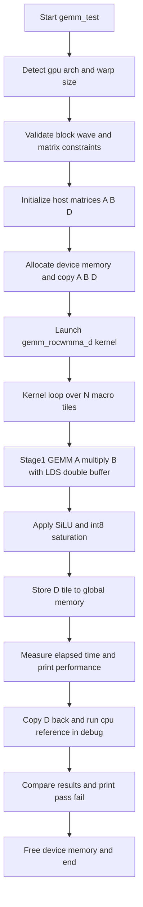
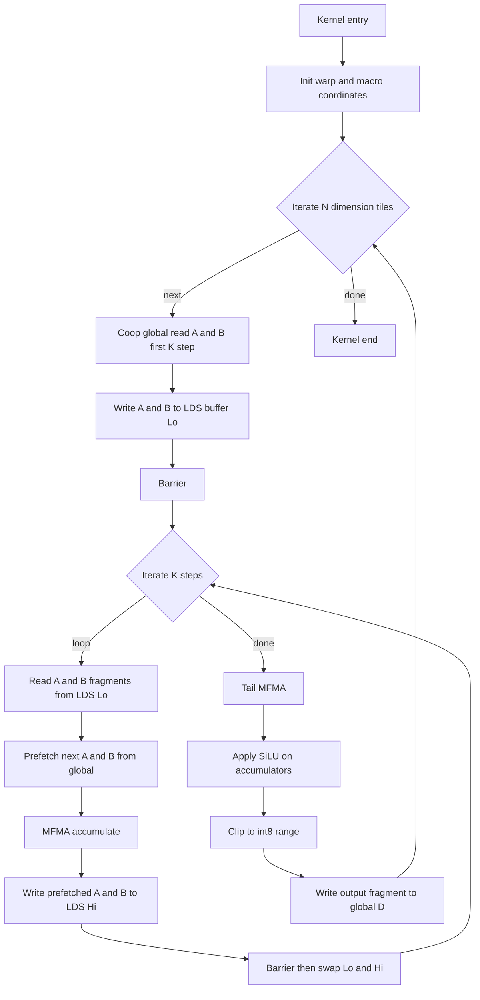

# simple_gemm_act: Architecture Porting Notes (CDNA & RDNA)

## Bug Fix: WARP_SIZE Mismatch

### Problem
Kernel was hardcoded for gfx9 (CDNA, wave64):
```cpp
WARP_SIZE = Constants::AMDGCN_WAVE_SIZE_64
```
gfx1201 (RDNA4) uses wave32, causing all geometry calculations to be wrong.

### Symptom
```
FAILED
Max relative error: 0.992188
```
`0.992188 = 127/128` -- GPU outputs 0 where reference expects 127 (or vice versa),
indicating the GEMM accumulation is completely wrong (not just precision drift).

### Impact (WARP_SIZE=64 on wave32 hardware)

| Calculation | Expected (wave32) | Actual (wrong) | Effect |
|---|---|---|---|
| `WARPS_X = TBLOCK_X / WARP_SIZE` | `128/32 = 4` | `128/64 = 2` | Only 2 warps recognized, 4 warps exist |
| `MACRO_TILE_X = WARPS_X * WARP_TILE_X` | `4*32 = 128` | `2*32 = 64` | Half the macro tile |
| `localWarpCoord.x = threadIdx.x / WARP_SIZE` | 0,1,2,3 (unique) | 0,0,1,1 (overlap) | Warps 2,3 compute same coord as 0,1 |
| `num_elements` per thread (16x16 acc) | `16*16/32 = 8` | `16*16/64 = 4` | Fragment data misinterpreted |

### Why warps overlap causes wrong results

```
wave32 actual warps:     wave64 assumed mapping:
  Warp 0: threads 0-31     threadIdx.x / 64 = 0  --> warp coord 0
  Warp 1: threads 32-63    threadIdx.x / 64 = 0  --> warp coord 0  (COLLISION!)
  Warp 2: threads 64-95    threadIdx.x / 64 = 1  --> warp coord 1
  Warp 3: threads 96-127   threadIdx.x / 64 = 1  --> warp coord 1  (COLLISION!)
```

Warps 0 and 1 both think they are warp (0, y), so they:
- Read the SAME A/B input tiles from LDS
- Write their GEMM results to the SAME D output location
- One warp's output overwrites the other's --> data corruption

### Fix (Unified CDNA & RDNA Support)
To support both CDNA (wave64) and RDNA (wave32) architectures seamlessly, we introduced architecture-specific configuration namespaces (`gfx9Params` and `gfx11Params`). The device code uses preprocessor directives (`#if(ROCWMMA_ARCH_GFX9)`) to ensure the correct `WARP_SIZE` is statically compiled, while the host code uses `isGfx9()` to dynamically pick parameters at runtime.

```cpp
namespace gfx9Params {
    // ...
    WARP_SIZE = Constants::AMDGCN_WAVE_SIZE_64
};

namespace gfx11Params {
    // ...
    WARP_SIZE = Constants::AMDGCN_WAVE_SIZE_32
};

#if(ROCWMMA_ARCH_GFX9)
using namespace gfx9Params;
#else
using namespace gfx11Params;
#endif
```

And on the host side:
```cpp
uint32_t hWARP_TILE_X = isGfx9() ? gfx9Params::TBLOCK_X : gfx11Params::TBLOCK_X;
// ...
```

### Result after fix
```
PASSED
Max relative error: 0
```

### Note
The host-side `getWarpSize()` check (line 789-793) validates that hardware warp size
matches expectations, but it does NOT fix the **compile-time constant** `WARP_SIZE`
used in all kernel geometry calculations. Both must agree.

---

## Appendix A: End-to-End Flowchart (Host + Kernel)



## Appendix B: Kernel Internal Flowchart



## Appendix C: Logic Review Summary

### C.1 計算定義與資料型別

- 計算目標是 `D = silu(A x B)`，其中 `A`/`B` 是 `int8`，累加使用 `int32`，輸出 `int8`。
- `DoSilu` 會先做 SiLU（若 `apply_silu=true`），再做 `int8` 飽和裁切（`INT8_MIN ~ INT8_MAX`）。
- CPU 參考路徑 `gemm_act_cpu` 和 GPU 路徑一致，debug 模式會做逐元素比對。

### C.2 Kernel 資料流與同步

- A/B 先用 cooperative load 讀到 fragment，再寫入 LDS。
- 主 K 迴圈使用 Lo/Hi 雙緩衝，重疊「下一步 global read」與「當前步計算」。
- 每輪交換 Lo/Hi 前都有 `synchronize_workgroup()`，可避免讀寫競態。
- 收尾做 tail MFMA，再直接在 register fragment 內做 SiLU 與裁切，最後回寫 D。

### C.3 Host 流程核對

- Host 會依 `isGfx9()` 與 `getWarpSize()` 計算 runtime tile 幾何。
- 啟動時指定動態 LDS 大小，並以 warmup + recordRuns 方式量測。
- `#if !NDEBUG` 會回傳 D 並和 CPU reference 比對，輸出 `PASSED/FAILED`。

## Appendix D: Improvement Opportunities

### D.1 Correctness priority

1. 潛在 barrier deadlock 風險  
   位置：`simple_gemm_act.cpp:545-549`  
   問題：當 warp 邊界越界時直接 `return`，但同 block 其他 warp 可能仍會進到後續 barrier。  
   建議：  
   - 簡單作法：Host 端額外限制 `m`/`n` 必須是 macro tile 整倍數。  
   - 完整作法：改成 predication，不要在 kernel 中做 warp 級 early return。

### D.2 Maintainability and performance

1. 註解中的固定 tile 設定和實際架構分流可能不一致  
   位置：`529-534` 的註解仍寫固定 `(64,64)` / `(2,2)`。  
   建議：改為公式或「依 wave32/wave64 的條件說明」。

2. 未使用變數可清理  
   例如：`els_per_thread`, `threads_per_row`, `warpCount`, `warpIndex`。  
   建議：移除或補上用途註解，減少閱讀噪音。

3. CPU 參考實作採巢狀 OpenMP  
   位置：`742-746`  
   建議：改用 `collapse(2)` 或單層 parallel，避免 thread oversubscription。

4. 效能指標只用 GEMM FLOPs 估算  
   位置：`923-925`  
   建議：可額外標示 activation 開銷或至少註明「指標主要反映 GEMM 主體」。
