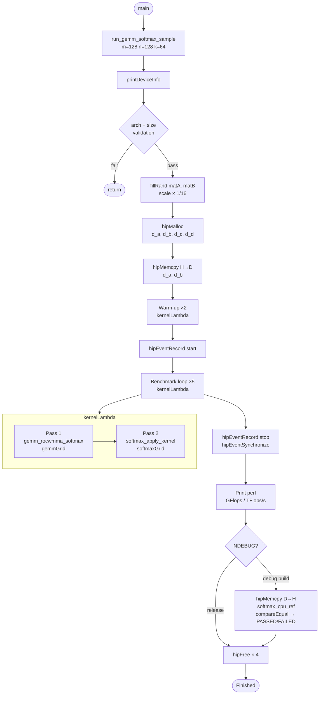
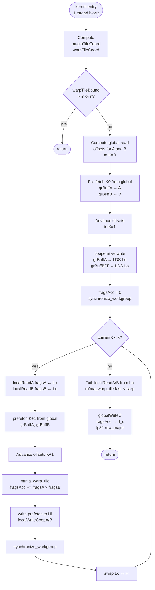
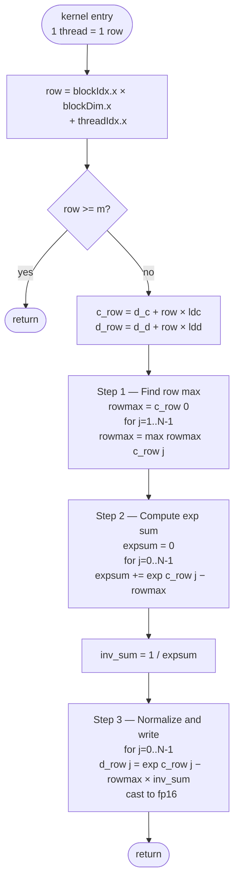

# simple_gemm_softmax — GEMM + Row-wise Softmax Fused Sample

## Overview

This sample demonstrates fusing a rocWMMA GEMM with a **row-wise numerically-stable Softmax**
in a two-pass GPU kernel.  The pattern is the attention score normalization sub-step of
Scaled Dot-Product Attention (SDPA), used in every Transformer model.

```
C      = A × B                             [M × N] = [M × K] × [K × N]
m_i    = max_j  C[i, j]                   row maximum (numerical stability)
e_ij   = exp( C[i, j] − m_i )
D[i,j] = e_ij  /  Σ_j e_ij               row-normalised softmax output
```

In full SDPA the role of each matrix is:

```
A  ←  Q  (query)   [seq_len × d_head]
B  ←  K  (key)     [d_head  × seq_len]  (already transposed)
D  =  Softmax_row( Q × K^T / √d_k )     attention weight matrix
```

---

## Why Two Passes?

rocWMMA accumulator elements are distributed across threads in an
architecture-specific pattern.  Computing a **row reduction** (finding the row
max or summing exp values) directly on accumulator fragments would require
knowledge of that internal layout.

Using a separate **scalar kernel** for the softmax pass:

- Reads the float32 GEMM result from global memory (simple linear access)
- One thread owns exactly one complete row → no cross-thread synchronisation needed
- Code is architecture-portable and easy to validate

The float32 intermediate workspace (`d_c`) is the only extra memory cost: `M × N × 4 bytes`.

---

## Algorithm Details

### Pass 1 — rocWMMA GEMM (`gemm_rocwmma_softmax`)

| Feature | Detail |
|---|---|
| Fragment API | rocWMMA `mma_sync` (MFMA hardware) |
| Input type | `float16_t` (fp16) |
| Accumulator type | `float32_t` (fp32) |
| LDS layout | `col_major`, two segments: **A \| B^T** |
| Prefetch strategy | Ping-pong double buffering (Lo / Hi) |
| Output | float32 workspace `d_c` [M × N] |

Tile sizes per architecture:

| Architecture | MACRO\_TILE\_X | MACRO\_TILE\_Y | ROCWMMA\_K | TBLOCK\_X | TBLOCK\_Y | WARP\_SIZE |
|---|---|---|---|---|---|---|
| gfx9 (MI200/MI300X) | 64 | 64 | 16 | 128 | 2 | 64 (Wave64) |
| gfx11/gfx12 (RDNA3/RDNA4) | 32 | 64 | 16 | 64 | 2 | 32 (Wave32) |

### Pass 2 — Row-wise Softmax (`softmax_apply_kernel`)

Each GPU thread handles **exactly one row** of the M × N output matrix.

Three sequential passes over the row (length N):

| Step | Operation | Purpose |
|---|---|---|
| 1 | `rowmax = max_j C[i,j]` | Find row maximum |
| 2 | `expsum = Σ_j exp(C[i,j] − rowmax)` | Compute shifted exp sum |
| 3 | `D[i,j] = exp(C[i,j] − rowmax) / expsum` | Normalize, cast to fp16 |

**Why subtract `rowmax`?** — Numerical stability.  Without the subtraction,
`exp(large_value)` overflows to `+Inf`.  Subtracting the row max shifts all
inputs to `(−∞, 0]`, keeping exponentials in `(0, 1]`.  The softmax value is
mathematically unchanged because:

```
exp(x − m) / Σ exp(xⱼ − m)  =  exp(x) / Σ exp(xⱼ)
```

---

## Data Layouts

| Matrix | Shape | Type | Layout | Leading dim |
|---|---|---|---|---|
| A | M × K | `float16_t` | row\_major | K |
| B | K × N | `float16_t` | row\_major | N |
| C (workspace) | M × N | `float32_t` | row\_major | N |
| D (output) | M × N | `float16_t` | row\_major | N |

LDS layout uses `col_major` for both A and B^T segments to maximise bank-conflict-free access.

---

## Tile Hierarchy

```
Global matrix  [M × N]
│
├── MacroTile  [MACRO_TILE_X × MACRO_TILE_Y]  ← 1 thread block (workgroup)
│   │
│   └── WarpTile  [WARP_TILE_X × WARP_TILE_Y]  ← 1 warp (wave)
│       │
│       └── MfmaBlock  [ROCWMMA_M × ROCWMMA_N]  ← 1 mma_sync call
│           repeated BLOCKS_X × BLOCKS_Y times per warp tile
```

For gfx12 (RX 9070, gfx1201) with TBLOCK\_X=64, TBLOCK\_Y=2:

```
WARPS_X      = 64 / 32 = 2
WARPS_Y      = 2
WARP_TILE_X  = 2 × 16 = 32
WARP_TILE_Y  = 2 × 16 = 32
MACRO_TILE_X = 2 × 32 = 64   ← but gemmGrid.x = ceil(128/64)= 2
MACRO_TILE_Y = 2 × 32 = 64       gemmGrid.y = ceil(128/64)= 2
```

---

## LDS Layout (col\_major, per buffer)

```
             <---- MACRO_TILE_K (= ROCWMMA_K = 16) ---->
            ┌─────────────────────────────────────────────┐  ─┐
            │                                             │   │
            │   A segment                                 │   │  MACRO_TILE_X rows
            │   [MACRO_TILE_X × MACRO_TILE_K]             │   │  (A tile, not transposed)
            │                                             │   │
            ├─────────────────────────────────────────────┤  ─┤
            │                                             │   │
            │   B^T segment                               │   │  MACRO_TILE_Y rows
            │   [MACRO_TILE_Y × MACRO_TILE_K]             │   │  (B tile, transposed)
            │                                             │   │
            └─────────────────────────────────────────────┘  ─┘

Two such buffers (Lo and Hi) are allocated back-to-back:
  ldsPtrLo  →  buffer 0
  ldsPtrHi  →  buffer 1  (ldsPtrLo + sizeLds)
```

---

## Fragment Types

| Type alias | rocWMMA fragment | Role |
|---|---|---|
| `MfmaFragA` | `fragment<matrix_a,    M, N, K, fp16, row_major>` | A MFMA input |
| `MfmaFragB` | `fragment<matrix_b,    M, N, K, fp16, row_major>` | B MFMA input |
| `MfmaFragAcc` | `fragment<accumulator, M, N, K, fp32>` | fp32 accumulator |
| `MfmaFragAccStore` | `fragment<accumulator, M, N, K, fp32, row_major>` | Store offset arithmetic |
| `GRBuffA` | Macro-tile A cooperative read fragment | Global→registers (all warps) |
| `GRBuffB` | Macro-tile B cooperative read fragment | Global→registers (all warps) |
| `LWBuffA` | `apply_data_layout<GRBuffA, col_major>` | Registers→LDS |
| `LWBuffB` | `apply_data_layout<transpose(GRBuffB), col_major>` | Registers→LDS (transposed) |
| `LRFragA` | `apply_data_layout<MfmaFragA, col_major>` | LDS→registers |
| `LRFragB` | `apply_data_layout<transpose(MfmaFragB), col_major>` | LDS→registers |

---

## Code Structure

```
simple_gemm_softmax.cpp
│
├── Architecture namespaces
│   ├── gfx9Params   { M=16, N=16, K=16, BX=2, BY=2, TX=128, TY=2, WS=64 }
│   └── gfx11Params  { M=16, N=16, K=16, BX=2, BY=2, TX=64,  TY=2, WS=32 }
│
├── Type aliases
│   InputT=fp16, OutputT=fp16, ComputeT=fp32
│
├── Device helpers (Pass 1)
│   ├── globalReadCoopA / globalReadCoopB
│   ├── localWriteCoopA / localWriteCoopB
│   ├── localReadA / localReadB
│   ├── clear_acc_fragments
│   ├── mfma_warp_tile
│   └── globalWriteC
│
├── gemm_rocwmma_softmax()       ← GPU kernel, Pass 1
│
├── softmax_apply_kernel()       ← GPU kernel, Pass 2
│
├── softmax_cpu_ref()            ← CPU reference (debug validation)
│
├── printDeviceInfo()
│
├── run_gemm_softmax_sample()    ← Host driver
│
└── main()                       → run_gemm_softmax_sample(128, 128, 64)
```

---

## Flow Charts

### 1 — Overall Host Program Flow



---

### 2 — Pass 1: GEMM Kernel (`gemm_rocwmma_softmax`)



---

### 3 — Pass 2: Softmax Kernel (`softmax_apply_kernel`)



---

### 4 — LDS Double-Buffer (Ping-Pong) Detail

```mermaid
sequenceDiagram
    participant GM as Global Memory
    participant GR as Registers (grBuff)
    participant Lo as LDS Lo buffer
    participant Hi as LDS Hi buffer
    participant ACC as Accumulator (fragsAcc)

    Note over GM,ACC: Pre-fetch (K=0)
    GM->>GR: globalReadCoop A,B  [K=0]
    GR->>Lo: localWriteCoop A,B^T
    Note over ACC: fragsAcc = 0 ; sync

    loop K = 1 .. k/K_step - 1
        Lo->>ACC: localRead A,B  [K-1]  (LDS read)
        GM->>GR: globalReadCoop A,B  [K]  (prefetch, overlapped)
        ACC->>ACC: mfma_warp_tile  [K-1]  (compute)
        GR->>Hi: localWriteCoop A,B^T  [K]
        Note over Lo,Hi: sync ; swap Lo↔Hi
    end

    Note over GM,ACC: Tail (last K-step)
    Lo->>ACC: localRead A,B  [last]
    ACC->>ACC: mfma_warp_tile  [last]

    Note over ACC: globalWriteC → d_c (fp32)
```

---

## Performance Result (RX 9070 / gfx1201)

**Hardware:** AMD Radeon RX 9070 — gfx1201 (RDNA4), Wave32, 28 CUs, 2120 MHz

```
=== GPU Hardware Info ===
  Device name     : AMD Radeon RX 9070
  GCN arch        : gfx1201
  Warp size       : 32
  Global memory   : 16304 MiB
  Shared mem/blk  : 64 KiB
  Max clock (MHz) : 2120
  Memory bw (GB/s): 80

TBlkX   TBlkY   BlkM  BlkN  BlkK  MatM    MatN    MatK    lda  ldb  ldd  elapsedMs     GFlops(GEMM)  TFlops/s
64      2       16    16    16    128     128     64      64   128  128  0.522398      0.0104858     0.0200724

Validating against CPU reference...
PASSED
Max relative error: 0
```

> The problem size (128×128×64) is very small.  The low TFlops/s figure reflects
> kernel launch overhead dominating over compute time, not hardware throughput.
> Use a larger matrix (e.g. 4096×4096×256) to measure peak GEMM performance.

---

## Key Implementation Notes

### Input Scaling

```cpp
constexpr float kScale = 1.0f / 16.0f;
```

`fillRand` fills elements with small integers (0–4).  Without scaling,
`max|C_ij| ≈ K × 4² = 1024` for K=64, causing `exp(1024)` → `+Inf` in softmax.
Scaling to `[0, 0.25]` keeps `max|C_ij| ≈ 4` so `exp(4) ≈ 54` — well within fp16 range.

### `__expf` vs `std::expf`

| Context | Function | Reason |
|---|---|---|
| GPU kernel (Pass 2) | `__expf(x)` | HW fast-math intrinsic, ~4 ULP error |
| CPU reference | `std::expf(x)` | Standard C++ float exp |

### `uint64_t` Row Pointer Arithmetic

```cpp
ComputeT const* c_row = c + (uint64_t)row * ldc;
OutputT*        d_row = d + (uint64_t)row * ldd;
```

Casting to `uint64_t` before multiply prevents 32-bit overflow for large matrices
(e.g. M=65536, N=65536 → row offset > 4 GB).

### `MfmaFragAccStore` — Why a Second Accumulator Type?

`MfmaFragAcc` has no `DataLayout` template parameter (rocWMMA default).
`GetDataLayout_t<>` requires an explicit layout to compute 1-D offsets.
`MfmaFragAccStore` adds `DataLayoutD = row_major` solely for offset arithmetic
and `store_matrix_sync`; accumulation is done with `MfmaFragAcc`.

---

## Relationship to Other Samples

| Sample | Algorithm | Softmax? | Notes |
|---|---|---|---|
| `simple_hgemm.cpp` | GEMM only | No | Baseline FP16 GEMM |
| `simple_gemm_act.cpp` | GEMM + SiLU | No | Element-wise activation |
| `simple_gemm_swiglu.cpp` | 2×GEMM + SwiGLU | No | Dual-GEMM Hadamard |
| `simple_gemm_rmsnorm.cpp` | GEMM + RMSNorm | No | Row reduction, gamma scale |
| **`simple_gemm_softmax.cpp`** | **GEMM + Softmax** | **Yes** | **Row max+exp+norm** |
| `simple_sdpa.cpp` *(planned)* | Full SDPA | Yes | Scale + Softmax + ×V |
| `simple_flash_attn.cpp` *(planned)* | Flash Attention | Yes | Tiled online softmax |

### SDPA context: where this sample fits

```
Full SDPA:
  1.  Scores = Q × K^T / sqrt(d_k)     ← GEMM
  2.  Weights = Softmax_row(Scores)     ← THIS SAMPLE (steps 1+2)
  3.  Output  = Weights × V             ← another GEMM

This sample covers steps 1 and 2.
```

---

## Build

```bash
# From the rocWMMA build directory:
cmake ..
make simple_gemm_softmax

# Run
./simple_gemm_softmax
```

The target is registered in `samples/CMakeLists.txt`:

```cmake
add_rocwmma_sample(simple_gemm_softmax
    ${CMAKE_CURRENT_SOURCE_DIR}/simple_gemm_softmax.cpp)
```

---

## See Also

- `simple_gemm_rmsnorm.cpp` / `.md` — same two-pass pattern, RMSNorm instead of Softmax
- `simple_gemm_swiglu.cpp` / `.md` — dual-GEMM warp tile fusion
- `simple_fusion_gemm.cpp` / `.md` — chained GEMM (SxV attention output)
- rocWMMA documentation: `rocwmma/rocwmma.hpp`
