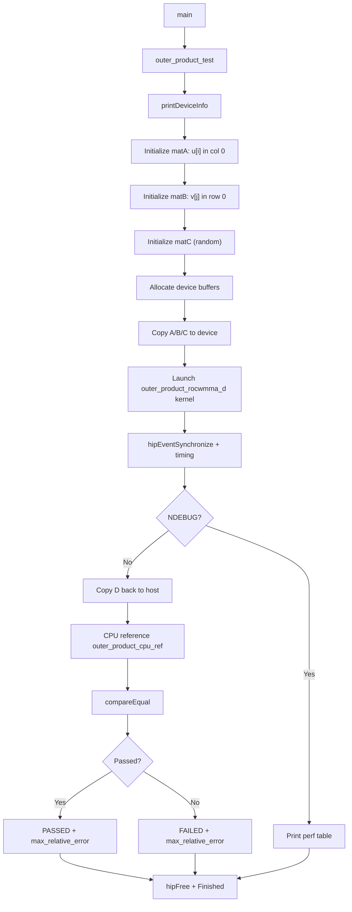
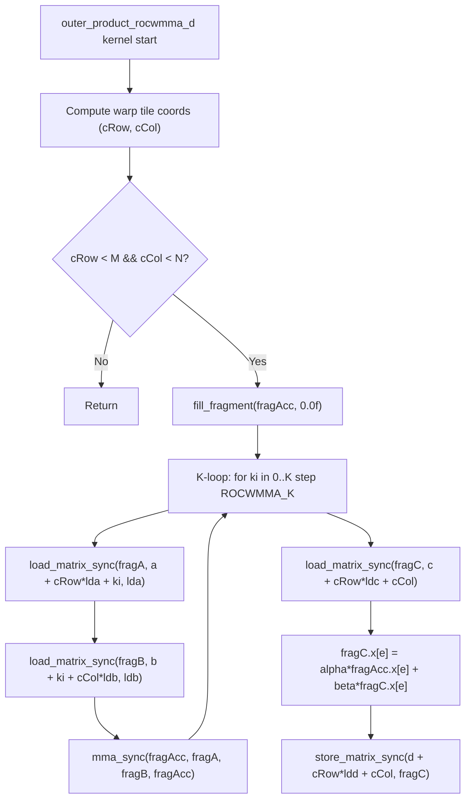

# simple_outer_product — Outer Product (Rank-1 Update) Sample

## Overview

This sample demonstrates the **outer product** of two vectors using rocWMMA:

```
D[M x N] = alpha * (u[M] x v[N]^T) + beta * C[M x N]
```

This is a **rank-1 GEMM** (K=1). The primary application is the **LoRA delta-weight update**:

```
delta_W = A_lora x B_lora      (rank r, each "slice" is an outer product)
```

---

## Algorithm

### Mathematical Formula

| Symbol | Shape | Description |
|---|---|---|
| `u` | `[M]` | Column vector |
| `v` | `[N]` | Row vector |
| `C` | `[M x N]` | Bias matrix (row\_major) |
| `D` | `[M x N]` | Output matrix (row\_major) |

```
D[i][j] = alpha * u[i] * v[j] + beta * C[i][j]
```

### K-dimension Padding Trick

rocWMMA requires K to be a multiple of `ROCWMMA_K = 16`. An outer product has K=1 conceptually. The sample bridges this gap by:

- **matA** `[M x 16]` row\_major — vector `u[i]` in **column 0** only; columns 1–15 = `0`
- **matB** `[16 x N]` col\_major — vector `v[j]` in **row 0** only; rows 1–15 = `0`

Since all other K-slots are zero, the MFMA result collapses to rank-1:

```
D[i][j] = alpha * A[i][0] * B[0][j] + beta * C[i][j]
         = alpha * u[i]   * v[j]    + beta * C[i][j]
```

---

## Data Layouts

| Matrix | Shape | Layout | Leading dim |
|---|---|---|---|
| A (u padded) | M x K | row\_major | K = 16 |
| B (v padded) | K x N | col\_major | K = 16 |
| C, D | M x N | row\_major | N |

---

## Architecture Compatibility

Uses `ROCWMMA_M = ROCWMMA_N = ROCWMMA_K = 16`:

| Architecture | Wave size | Status |
|---|---|---|
| gfx9 (MI200/MI300) | 64 | Supported |
| gfx11 (RDNA3) | 32 | Supported |
| gfx12 (RDNA4, gfx1201) | 32 | **Verified PASSED** |

No LDS required. No architecture-specific namespace selection needed.

---

## File Structure

```
simple_outer_product.cpp   - kernel + host driver
simple_outer_product.md    - this document
```

---

## Building

```bash
# From the rocwmma build directory
cmake --build . --target simple_outer_product
```

Or together with all samples:

```bash
cmake --build . --target rocwmma_samples
```

---

## Running

```bash
./samples/simple_outer_product
```

Default problem size: `M = 256, N = 256`, padded `K = 16`.

Debug validation (CPU reference enabled when built without `-DNDEBUG`):

```bash
cmake -DCMAKE_BUILD_TYPE=Debug ..
cmake --build . --target simple_outer_product
./samples/simple_outer_product
# prints PASSED / FAILED and max relative error
# also prints 8x8 corner of GPU result vs CPU reference
```

---

## Program Flow



---

## Kernel Flow



---

## Data Flow

```
u[M] (column vector)
    |
    v
matA[M x 16]  (col 0 = u, cols 1-15 = 0)
    |
    +----------> mma_sync -----------> fragAcc[M x N]
    |                                       |
matB[16 x N]  (row 0 = v, rows 1-15 = 0)   |
    |                                       v
    +---------->                   D[i][j] = alpha * u[i] * v[j] + beta * C[i][j]
```

---

## Validated Output (gfx1201 / AMD RX 9070)

```
=== GPU Hardware Info ===
  Device name     : AMD Radeon RX 9070
  GCN arch        : gfx1201
  Compute units   : 28
  Warp size       : 32
  Global memory   : 16304 MiB
  Shared mem/blk  : 64 KiB
========================

Outer product test: M=256 N=256 K(padded)=16
  Semantics: D[M x N] = alpha * u[M] x v[N]^T + beta * C[M x N]
  alpha=1  beta=1

BlkM   BlkN   BlkK   MatM   MatN   alpha  beta   elapsedMs   GFlops       TFlops/s
16     16     16     256    256    1      1      0.01412     0.000131072  0.00928272

Validating result with CPU reference...
PASSED!
Max relative error: 0
```

> **Note**: The GFlops figure reflects the true rank-1 cost (`2 * M * N * 1`), not the padded K=16 cost. The kernel internally runs K=16 iterations but only the K=0 slot carries data.

---

## Application Context

### LoRA (Low-Rank Adaptation)

```
Pre-trained weight:  W  [d_out x d_in]
LoRA update:    delta_W = A x B    where A [d_out x r], B [r x d_in]

For rank r=1:   delta_W = u x v^T  <-- single outer product
For rank r>1:   delta_W = sum_{k=1..r} u_k x v_k^T  <-- sum of outer products
```

Each call to `simple_outer_product` computes one rank-1 slice of the LoRA update.

---

## Key Kernel Parameters

```cpp
ROCWMMA_M = 16, ROCWMMA_N = 16, ROCWMMA_K = 16
T_BLOCK_X = 4 * WAVE_SIZE   (128 for Wave32, 256 for Wave64)
T_BLOCK_Y = 4
```

Each wave computes one `16 x 16` output tile. No LDS is used.

---

## Validation Notes

The CPU reference (`outer_product_cpu_ref`) loops over all K-slots and accumulates `A[i][ki] * B[ki][j]`. Since only `ki=0` has non-zero values, the result matches exactly the rank-1 formula. FP16 accumulation via MFMA (FP32 accumulator) produces **max relative error = 0** for the small input values used in this sample.
