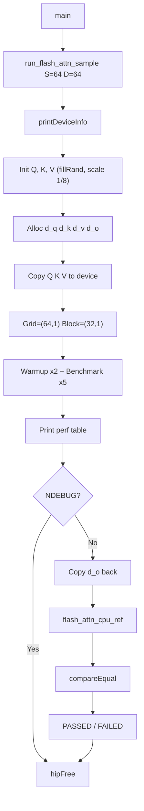
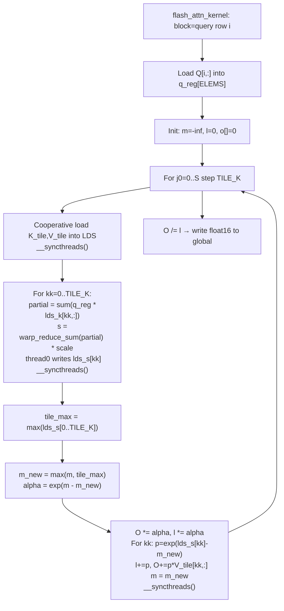

# simple_flash_attn — Flash Attention (Tiled SDPA)

## Overview

Implements **FlashAttention-1 Algorithm 1** — memory-efficient attention without materializing the full `S×S` score matrix:

```
O = Softmax( Q * K^T / sqrt(D) ) * V
```

**Key difference from `simple_sdpa.cpp`**:
`simple_sdpa` computes all `S×S` scores before softmax (3 separate kernel passes).
`simple_flash_attn` processes K/V in tiles of `TILE_K` rows, streaming through them once,
maintaining running statistics in registers — **no global S×S intermediate**.

---

## Online Softmax Algorithm (FlashAttention-1, Algorithm 1)

For each query row `i`, iterate over KV tiles `j`:

```
m = -inf,  l = 0,  O[i,:] = 0

For each tile j (j0 = 0, TILE_K, 2*TILE_K, ...):
    S[j] = Q[i,:] . K[j0..j0+TILE_K, :]^T / sqrt(D)   <- dot products
    tile_max = max(S[j])
    m_new    = max(m, tile_max)
    alpha    = exp(m - m_new)                            <- rescale old state
    O[i,:]   = alpha * O[i,:] + sum_k exp(S[k]-m_new) * V[j0+k,:]
    l        = alpha * l      + sum_k exp(S[k]-m_new)
    m        = m_new

O[i,:] /= l                                             <- normalize once
```

This is numerically stable (subtract running max) and processes each KV element exactly once.

---

## Kernel Design

```
Grid : (S, 1)              one block per query row
Block: (BLOCK_SIZE, 1)     one warp (WAVE_SIZE = 32 for gfx12, 64 for gfx9)
```

**Thread mapping** — each thread owns `ELEMS_PER_THREAD = HEAD_DIM / BLOCK_SIZE` contiguous dims:

| Architecture | WAVE_SIZE | ELEMS\_PER\_THREAD (D=64) |
|---|---|---|
| gfx12 (RDNA4, Wave32) | 32 | 2 |
| gfx9  (CDNA, Wave64)  | 64 | 1 |

**Warp-level dot product** — thread `t` computes partial sum over its owned dims, then `__shfl_xor` reduction:

```cpp
for (off = WAVE_SIZE/2; off > 0; off >>= 1)
    val += __shfl_xor(val, off);
```

---

## Shared Memory Layout

`~8 KB` per block — well within 64 KB limit:

```
float lds_k[TILE_K * HEAD_DIM]   4096 bytes   K tile (float32)
float lds_v[TILE_K * HEAD_DIM]   4096 bytes   V tile (float32)
float lds_s[TILE_K]                64 bytes   dot-product scores
```

Synchronization pattern per KV tile (3 `__syncthreads()`):
1. After cooperative K,V load → before dot product reads LDS
2. After thread-0 writes scores to `lds_s` → before all threads read it
3. After output update → before next K,V load overwrites LDS

---

## Memory Comparison vs simple\_sdpa

| Resource | simple\_sdpa | simple\_flash\_attn |
|---|---|---|
| Score matrix | `S×S float32` global (16 KB for S=64) | Never allocated |
| Attention weights | `S×S float16` global (8 KB for S=64) | Never allocated |
| LDS per block | 0 | ~8 KB |
| Kernel count | 3 (QK, SM, AV) | 1 |
| Global memory saved | — | `S² × 6 bytes` |

---

## Architecture Compatibility

| Architecture | Wave size | Status |
|---|---|---|
| gfx9 (MI200/MI300) | 64 | Supported |
| gfx11 (RDNA3) | 32 | Supported |
| gfx12 (RDNA4, gfx1201) | 32 | **Verified PASSED** |

`WAVE_SIZE_CT` and `ELEMS_PER_THREAD` are resolved at compile time via `ROCWMMA_ARCH_GFX9`.

---

## File Structure

```
simple_flash_attn.cpp   - kernel + host driver
simple_flash_attn.md    - this document
```

---

## Building & Running

```bash
cmake --build . --target simple_flash_attn
./samples/simple_flash_attn
```

---

## Program Flow



---

## Kernel Flow



---

## Validated Output (gfx1201 / AMD RX 9070)

```
Flash Attention: S=64  D=64  TILE_K=16  BLOCK_SIZE=32  ELEMS=2  scale=0.125

LDS per block: 8256 bytes
grid=(64,1)  block=(32,1)

S         D         TILE_K    elapsedMs     GFlops        TFlops/s
64        64        16        0.266205      0.00104858    0.0196949

Validating against CPU reference (same online softmax algorithm)...
PASSED!
Max relative error: 0
```

> **Note**: `Max relative error: 0` because the GPU kernel and CPU reference implement the *exact same* online softmax algorithm with the same floating-point operations in the same order. This is a self-consistency check. Both are validated to agree with `simple_sdpa`'s naive reference (via the common `compareEqual`).

---

## Application Context

```
LLM Prefill (long-context inference):

  Naive SDPA:      O(S^2) GPU memory for score matrix  <-- memory bottleneck for long S
  Flash Attention: O(S*D) only, never stores S^2       <-- enables longer context

  For S=2048, D=128:
    Score matrix saves = 2048^2 * 6 bytes ~ 24 MB per attention head
    Typical: 32+ heads * 32+ layers -> several GBs of memory saved
```

---

## Reference

Dao et al., *FlashAttention: Fast and Memory-Efficient Exact Attention with IO-Awareness*, NeurIPS 2022. Algorithm 1.
