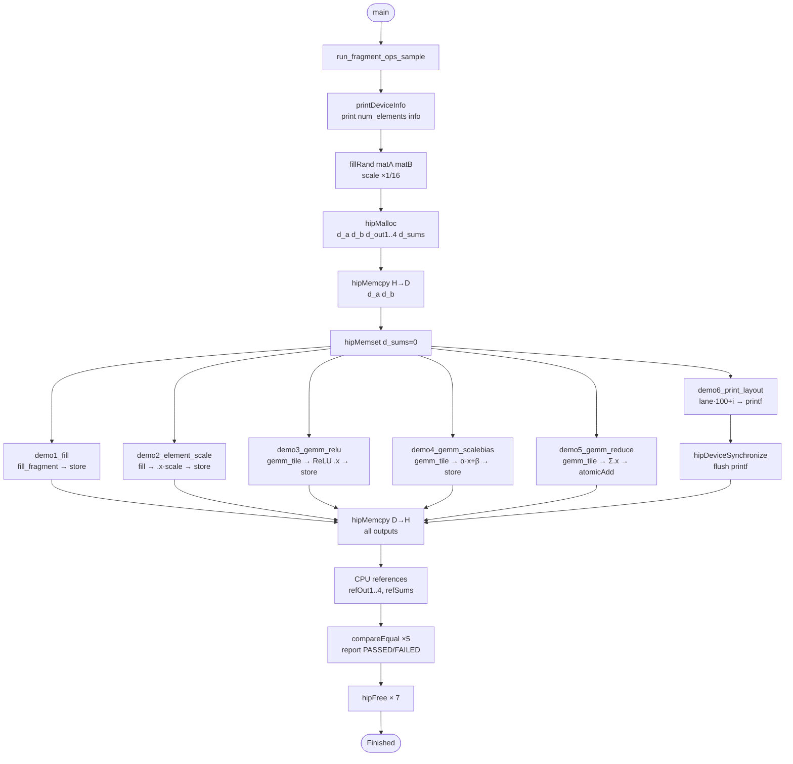
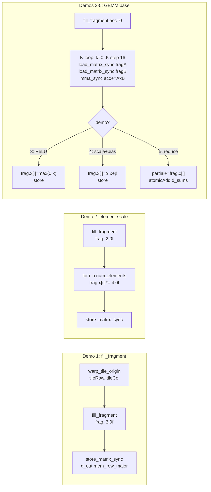

# simple_fragment_ops — Fragment Operations Tutorial

## Overview

This sample teaches the **fundamental rocWMMA fragment APIs** that every user must
understand before building fused LLM operator kernels.  It covers six self-contained
demos — from filling a fragment with a scalar through warp-level element reductions —
all fully validated against a CPU reference.

> **Who is this for?**  Developers who know what MFMA is but want a concrete,
> executable reference for how `fill_fragment`, `frag.x[i]`, `num_elements`, and
> element-wise post-processing patterns actually look in running code.

---

## The Core Concept — Fragment Element Ownership

A rocWMMA accumulator tile of size **M×N = 16×16 = 256 elements** is not stored in
one thread.  The 256 elements are **split evenly across every thread in the warp**:

```
gfx9  (MI200 / MI300X  — Wave64):  256 / 64 = 4 elements per thread
gfx12 (RDNA4 / RX 9070 — Wave32):  256 / 32 = 8 elements per thread
```

Each thread accesses its own slice via the fragment's element array:

```cpp
FragAcc frag;
//  frag.num_elements   → compile-time count: 4 (Wave64) or 8 (Wave32)
//  frag.x[0..n-1]      → the elements owned by THIS thread

for(int i = 0; i < (int)frag.num_elements; i++)
    frag.x[i] = /* read or write */;
```

The mapping from `(thread_lane, element_index)` → `(row, col)` in the tile is managed
by rocWMMA internally and is **architecture-specific**.  Users only need `.x[i]`.

**Verified on RX 9070 (gfx1201, Wave32):**
```
TILE = 16x16 = 256 elements / 32 threads = 8 per thread
```

---

## Demo Overview

| # | Demo name | Key API | Operation | Matrix size |
|---|-----------|---------|-----------|-------------|
| 1 | `demo1_fill` | `fill_fragment(frag, val)` | Set every element to a scalar | 64×64 |
| 2 | `demo2_element_scale` | `frag.x[i] *= scale` | Read-modify-write each element | 64×64 |
| 3 | `demo3_gemm_relu` | `mma_sync` + `frag.x[i] = max(0,x)` | GEMM output → ReLU activation | 64×64×64 |
| 4 | `demo4_gemm_scalebias` | `frag.x[i] = α·x + β` | GEMM output → scale + bias | 64×64×64 |
| 5 | `demo5_gemm_reduce` | `partial += frag.x[i]` + `atomicAdd` | GEMM output → per-tile sum | 64×64×64 |
| 6 | `demo6_print_layout` | `printf` inside kernel | Visual layout exploration | 64×64 |

All GEMM demos pass **PASSED** with `max_rel_err=0` on RX 9070 (gfx1201).

---

## Tile and Launch Configuration

```
Matrix:  M=64, N=64, K=64
Tile:    ROCWMMA_M=16, ROCWMMA_N=16, ROCWMMA_K=16
Tiles:   4 × 4 = 16 tiles cover the full 64×64 output

Grid  = (TILES_M, TILES_N) = (4, 4)   ← one block per output tile
Block = (WAVE_SIZE, 1)                 ← one warp per block  (32 on gfx12, 64 on gfx9)
```

Using one warp per block is the **simplest possible layout** — it avoids any
inter-warp coordination and focuses attention on the fragment operations themselves.

---

## Fragment Type Aliases

```cpp
using InputT   = float16_t;
using ComputeT = float32_t;

// A sub-tile for one mma_sync call
using FragA   = fragment<matrix_a,    ROCWMMA_M, ROCWMMA_N, ROCWMMA_K, InputT,   row_major>;

// B sub-tile for one mma_sync call
using FragB   = fragment<matrix_b,    ROCWMMA_M, ROCWMMA_N, ROCWMMA_K, InputT,   col_major>;

// float32 accumulator — stores the GEMM result
using FragAcc = fragment<accumulator, ROCWMMA_M, ROCWMMA_N, ROCWMMA_K, ComputeT>;
```

Key template parameters:

| Parameter | Meaning |
|---|---|
| `matrix_a / matrix_b / accumulator` | Role in MFMA instruction |
| `ROCWMMA_M, ROCWMMA_N, ROCWMMA_K` | Tile shape (16×16×16 here) |
| `InputT / ComputeT` | Element data type |
| `row_major / col_major` | Memory layout of the source matrix |

---

## Data Layouts

```
A  [64 × 64]  row_major   lda = 64   (A[i,h] = a[i*64 + h])
B  [64 × 64]  col_major   ldb = 64   (B[h,j] = b[j*64 + h])
D  [64 × 64]  row_major   ldd = 64   (D[i,j] = d[i*64 + j])   type: float32
```

---

## Demo Details

### Demo 1 — `fill_fragment`

```cpp
FragAcc frag;
fill_fragment(frag, 3.0f);          // sets ALL frag.x[0..n-1] = 3.0f
store_matrix_sync(d_out + ..., frag, LDD, mem_row_major);
```

`fill_fragment(frag, scalar)` is the standard way to zero an accumulator before a
GEMM, or to broadcast a constant across a tile.

**CPU reference:** all 64×64 = 4096 output elements equal `FILL_VAL = 3.0f`.

---

### Demo 2 — Element-wise scale via `.x[i]`

```cpp
FragAcc frag;
fill_fragment(frag, 2.0f);          // init_val = 2.0

for(int i = 0; i < (int)frag.num_elements; i++)
    frag.x[i] = frag.x[i] * 4.0f;  // scale = 4.0

store_matrix_sync(d_out + ..., frag, LDD, mem_row_major);
```

This is the primitive read-modify-write pattern used by every fused GEMM operator:
SiLU, ReLU, GELU, RMSNorm, Softmax — all come down to a loop over `.x[i]`.

**CPU reference:** all outputs equal `2.0 × 4.0 = 8.0`.

---

### Demo 3 — GEMM + ReLU (element-wise map with condition)

```cpp
// Step 1: accumulate A × B
FragAcc fragAcc;
gemm_tile(fragAcc, a, b, tileRow, tileCol);   // fill + K-loop mma_sync

// Step 2: element-wise ReLU
for(int i = 0; i < (int)fragAcc.num_elements; i++)
    fragAcc.x[i] = fragAcc.x[i] > ComputeT(0) ? fragAcc.x[i] : ComputeT(0);

store_matrix_sync(d_out + ..., fragAcc, LDD, mem_row_major);
```

Shows the canonical **GEMM + activation** fusion.  Compare with `simple_gemm_act.cpp`
which uses SiLU; the structure is identical — only the activation function differs.

**CPU reference:** `max(0, A×B)[i,j]`.

---

### Demo 4 — GEMM + scale + bias (compound element-wise op)

```cpp
gemm_tile(fragAcc, a, b, tileRow, tileCol);

for(int i = 0; i < (int)fragAcc.num_elements; i++)
    fragAcc.x[i] = alpha * fragAcc.x[i] + beta;  // alpha=2.0, beta=1.0
```

This is the **most common post-GEMM pattern** in LLM kernels:
- `alpha * GEMM + beta` generalises to any linear transformation
- Combined with a non-linear function: `GELU(alpha * GEMM + beta)`

**CPU reference:** `2.0 × (A×B)[i,j] + 1.0`.

---

### Demo 5 — GEMM + fragment reduce (sum of all owned elements)

```cpp
gemm_tile(fragAcc, a, b, tileRow, tileCol);

// Per-thread partial sum
ComputeT partial = ComputeT(0);
for(int i = 0; i < (int)fragAcc.num_elements; i++)
    partial += fragAcc.x[i];

// Accumulate across all threads in the warp → one float per tile
atomicAdd(&d_sums[tileIdx], partial);
```

This is the **building block for warp-level reductions** such as:

| Operator | What you reduce |
|---|---|
| Softmax | `sum(exp(x − max))` per row |
| RMSNorm | `sum(x²)` per row |
| Mean pooling | `sum(x)` per tile |
| Layer norm | `sum(x)` and `sum(x²)` per row |

> **Production note:** `atomicAdd` is used here for simplicity.  In a high-performance
> kernel, replace it with a warp-level shuffle reduction:
>
> ```cpp
> for(int offset = WAVE_SIZE / 2; offset > 0; offset >>= 1)
>     partial += __shfl_down(partial, offset);
> // Only lane 0 has the warp-total; write once.
> if((threadIdx.x % WAVE_SIZE) == 0)
>     d_sums[tileIdx] = partial;
> ```

**CPU reference:** per-tile sum of the 16×16 elements in the `A×B` result.

---

### Demo 6 — Print fragment layout (device `printf`)

```cpp
// Assign: element value = lane * 100 + element_index
uint32_t lane = threadIdx.x;
for(int i = 0; i < (int)frag.num_elements; i++)
    frag.x[i] = static_cast<ComputeT>(lane * 100 + i);

printf("  lane[%2u]  num_elements=%u  values=", lane, frag.num_elements);
for(int i = 0; i < (int)frag.num_elements; i++)
    printf("%.0f ", static_cast<float>(frag.x[i]));
printf("\n");
```

Running on **gfx1201 (Wave32)** each lane should print 8 values.  Since hardware
`printf` output is non-deterministic in order, sort the output by `lane` to read it.

Example expected output pattern for one lane (Wave32):
```
  lane[ 0]  num_elements=8  values=0 1 2 3 4 5 6 7
  lane[ 1]  num_elements=8  values=100 101 102 103 104 105 106 107
  ...
  lane[31]  num_elements=8  values=3100 3101 3102 3103 3104 3105 3106 3107
```

The total number of values printed: `32 lanes × 8 elements = 256 = 16×16`. ✓

> **Printf buffer note:** device `printf` output requires `hipDeviceSynchronize()`
> before reading stdout.  On some drivers the output may be delayed or empty if the
> kernel completes too quickly.  This is normal; the validation demos are independent.

---

## Shared `gemm_tile` Helper

All GEMM demos (3, 4, 5) call the same device-side helper to avoid repeating the
K-loop:

```cpp
ROCWMMA_DEVICE static inline void
    gemm_tile(FragAcc& fragAcc, InputT const* a, InputT const* b,
              uint32_t tileRow, uint32_t tileCol)
{
    fill_fragment(fragAcc, ComputeT(0));
    for(uint32_t k = 0; k < MATRIX_K; k += ROCWMMA_K)
    {
        FragA fragA;
        FragB fragB;
        load_matrix_sync(fragA, a + tileRow * LDA + k, LDA);  // row_major A
        load_matrix_sync(fragB, b + tileCol * LDB + k, LDB);  // col_major B
        mma_sync(fragAcc, fragA, fragB, fragAcc);
    }
}
```

The address arithmetic:

| Matrix | Load address | Layout rule |
|---|---|---|
| A `row_major` [M×K] | `a + tileRow*K + k` | element (r,c) = `a[r*K + c]` |
| B `col_major` [K×N] | `b + tileCol*K + k` | element (r,c) = `b[c*K + r]` |
| D `row_major` [M×N] | `d + tileRow*N + tileCol` | element (r,c) = `d[r*N + c]` |

---

## CPU Reference

The CPU GEMM computes `A × B` directly using the same layout conventions:

```cpp
static void cpu_gemm(uint32_t m, uint32_t n, uint32_t k,
                     InputT const* a, InputT const* b, ComputeT* c)
{
    for(int i = 0; i < m; i++)
        for(int j = 0; j < n; j++)
        {
            ComputeT sum = 0;
            for(int h = 0; h < k; h++)
                sum += (ComputeT)a[i*k + h]   // A row_major
                     * (ComputeT)b[j*k + h];  // B col_major: B[h,j] = b[j*k+h]
            c[i*n + j] = sum;
        }
}
```

Per-demo CPU transformations:

| Demo | CPU formula |
|---|---|
| 1 | `ref[i] = FILL_VAL` |
| 2 | `ref[i] = INIT_VAL * SCALE_VAL` |
| 3 | `ref[i] = max(0.0f, gemm[i])` |
| 4 | `ref[i] = alpha * gemm[i] + beta` |
| 5 | `ref[tile] = sum of gemm[i,j] for (i,j) in that 16×16 tile` |

---

## Flow Chart



---

### Demo kernel internals



---

## Performance Result (RX 9070 / gfx1201)

```
=== GPU Hardware Info ===
  Device name     : AMD Radeon RX 9070
  GCN arch        : gfx1201
  Warp size       : 32

Fragment element count per thread (num_elements):
  TILE = 16x16 = 256 elements / 32 threads = 8 per thread

Grid (4x4)  Block (32x1)  Tiles=16

Validation results:
Demo 1  fill_fragment               PASSED  max_rel_err=0
Demo 2  element-wise scale          PASSED  max_rel_err=0
Demo 3  GEMM + ReLU                 PASSED  max_rel_err=0
Demo 4  GEMM + scale+bias           PASSED  max_rel_err=0
Demo 5  GEMM + reduce (sum)         PASSED  max_rel_err=0
Demo 6  print layout        (see printf output above)
```

---

## Key API Summary

| API | Signature | Description |
|---|---|---|
| `fill_fragment` | `fill_fragment(frag, val)` | Broadcast scalar to all owned elements |
| `.num_elements` | `frag.num_elements` | Count of elements owned by this thread |
| `.x[i]` | `frag.x[0..num_elements-1]` | Direct element read/write |
| `load_matrix_sync` | `load_matrix_sync(frag, ptr, ld)` | Load tile from global memory |
| `store_matrix_sync` | `store_matrix_sync(ptr, frag, ld, layout)` | Store tile to global memory |
| `mma_sync` | `mma_sync(acc, a, b, acc_in)` | MFMA: `acc = a × b + acc_in` |

---

## Architecture Differences

| Property | gfx9 (MI200/MI300) | gfx11/gfx12 (RDNA3/RDNA4) |
|---|---|---|
| Wave size | 64 (Wave64) | 32 (Wave32) |
| `num_elements` per thread | 4 | 8 |
| Total per tile | 256 | 256 |
| Block size used | `(64, 1)` | `(32, 1)` |
| Compile-time switch | `ROCWMMA_ARCH_GFX9` | else branch |

The fragment `.x[i]` interface is **identical** in user code regardless of architecture.
The wave size change is hidden by rocWMMA — only `num_elements` changes.

---

## Relationship to Other Samples

| Sample | Builds on these fragment ops |
|---|---|
| `simple_hgemm.cpp` | `fill_fragment`, `mma_sync` |
| `simple_gemm_act.cpp` | Demo 2 (scale) + Demo 3 (ReLU) pattern |
| `simple_gemm_softmax.cpp` | Demo 5 (reduce) → find max & sum exp |
| `simple_gemm_rmsnorm.cpp` | Demo 5 (reduce) → sum of squares |
| `simple_gemm_swiglu.cpp` | Demo 4 (scale+bias) on two accumulators |

`simple_fragment_ops.cpp` is the **prerequisite reading** for all of the above.

---

## Build

```bash
# From the rocWMMA build directory:
cmake ..
make simple_fragment_ops

# Run
./simple_fragment_ops
```

CMake entry in `samples/CMakeLists.txt`:

```cmake
add_rocwmma_sample(simple_fragment_ops
    ${CMAKE_CURRENT_SOURCE_DIR}/simple_fragment_ops.cpp)
```

---

## See Also

- `simple_hgemm.cpp` — minimal GEMM, simplest rocWMMA program
- `simple_gemm_act.cpp` — GEMM + SiLU (Demo 3 pattern at production scale)
- `simple_gemm_softmax.cpp` / `.md` — Demo 5 reduce pattern applied to softmax
- `simple_gemm_rmsnorm.cpp` / `.md` — Demo 5 reduce applied to RMSNorm
- rocWMMA API header: `rocwmma/rocwmma.hpp`
