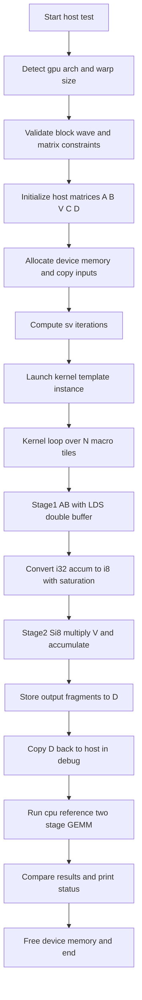
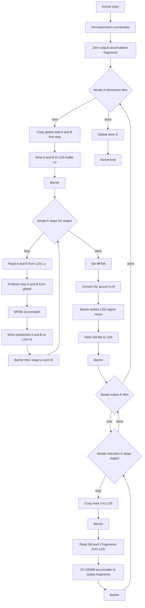

# simple_fusion_gemm.cpp 邏輯核對與流程說明

## 1) 這支 sample 在做什麼

此程式做的是兩段融合 GEMM：

- 第一段：`S = A x B`，`A[m,k]`、`B[k,n]`，累加型別 `int32`
- 轉型：`S_i8 = saturate_int8(S)`（clip 到 `[-128, 127]`）
- 第二段：`D = S_i8 x V`，`V[n,k]`
- 輸出：`D[m,k]`，型別 `int32`

程式中的 `c / alpha / beta` 目前沒有實際參與計算（僅保留介面與列印）。

## 2) 我確認過的核心邏輯

### 2.1 參數與架構分流

- `gfx9Params` 使用 wave64；`gfx11Params`（含 gfx12 路徑）使用 wave32（`simple_fusion_gemm.cpp:276-310`）。
- Host 端用 `isGfx9()` / `getWarpSize()` 決定 launch 幾何，避免 host/device warp size 假設不一致（`1045-1060`）。

### 2.2 版面配置與矩陣維度

- `A`: row-major，`lda = k`（`1096`）
- `B`: col-major，`ldb = k`（`1097`）
- `V`: col-major，`ldv = n`（`1100`）
- `D`: row-major，`ldd = k`（`1099`）

第二段 GEMM 使用 `S[m,n] x V[n,k] -> D[m,k]`，host 參考路徑與 device 路徑的維度定義一致（`1313-1315`）。

### 2.3 Kernel 主要流程（`gemm_rocwmma_d`）

1. 依 thread block 取得 `warp` 座標，算出每個 warp 的 tile 偏移（`740-748`）。
2. `fragsOut[SV_ITERS]` 先清零，作為最終 `D` 的累加寄存器（`756-760`）。
3. 外圈 `iter` 走 `n` 維 macro-tile（`762-766`），每次處理一個 `A x B` 的 `S` 子塊。
4. 第一段 GEMM (`A x B`)：
   - 先 cooperative global read A/B 到暫存 fragment（`810-817`）
   - 寫入 LDS（`856-857`）
   - K-loop 中做雙 buffer：
     - 從 `ldsPtrLo` 讀 A/B fragment（`879-880`）
     - 同時 prefetch 下一個 K chunk（`883-888`）
     - `mfma` 累加（`891`）
     - 寫到 `ldsPtrHi`，barrier 後 swap（`894-903`）
   - tail 再做一次 `mfma`（`912-915`）
5. `int32 -> int8` 飽和轉換，並把 `S_i8` 寫回 LDS（`920-935`）。
6. 第二段 GEMM (`S_i8 x V`)：
   - 外圈 `sv_iter` 走輸出 `k` 維 macro-tile（`938-939`）
   - 內圈 `currentK` 走 reduction（大小為 `MACRO_TILE_Y`，步長 `ROCWMMA_K`，`962`）
   - 每步：
     - global read `V` -> LDS（`964-968`）
     - local read `S`/`V` fragment（`975-979`）
     - `svgemm` 累加到 `fragsOut[sv_iter]`（`981`）
7. 所有 `iter` 完成後，把 `fragsOut` 寫回 `D`（`988-995`）。

### 2.4 同步點確認

- 第一段雙 buffer 迴圈內有同步（`897-898`）。
- 第一段尾端到第二段覆寫 LDS 前有同步（`931-932`）。
- 第二段每個 K-step 也有同步（`968`, `983`）。

以上同步點能覆蓋主要 LDS 讀寫 hazard。

## 3) Host 流程總結（`gemm_test`）

1. 檢查架構與 block/wave 合法性（`1062-1085`）。
2. 檢查矩陣尺寸下限與基本對齊（`1087-1093`）。
3. 產生隨機 `A/B/C/V`，配置 device memory 並拷貝（`1104-1143`）。
4. 根據 `sv_iterations = ceil(k / MACRO_TILE_Y)`，以 `switch` 實例化 `gemm_rocwmma_d<SV>`（`1157-1226`）。
5. 計時與效能輸出（`1238-1272`）。
6. Debug 模式下做 CPU reference：
   - 先算 `A x B`
   - 做 `int32 -> int8` 飽和
   - 再算 `S_i8 x V`
   - 與 GPU `D` 比對（`1285-1327`）。

## 4) 可改進處（依優先級）

### P0（建議先處理）

1. 邊界條件可能造成 workgroup barrier deadlock  
   位置：`769-773` + 後續多個 `synchronize_workgroup()`  
   問題：用 `return` 做 warp 級 early-exit，但同一 block 其他 warp 仍會走到 barrier。  
   觸發條件：`m` 或 `n` 不是 macro tile 整倍數時，部分 warp 可能越界、部分不越界。  
   建議：  
   - 最快修法：host 端直接限制 `m % MACRO_TILE_X == 0 && n % MACRO_TILE_Y == 0`。  
   - 更完整：改成 predication（越界 warp 不做 load/store/mma，但不能 return，仍要參與 barrier）。

### P1（功能/可維護性）

1. `sv_iterations > 32` 時目前只印錯誤訊息，計時流程仍繼續  
   位置：`1220-1224`  
   建議：在 host 端提早 `return` 或 fallback 到非模板化路徑，避免拿到無效效能/結果。

2. `if(isGfx9() && ... || ...)` 括號優先序可讀性差、易誤判  
   位置：`1069`  
   建議：改成 `if(isGfx9() && ((...) || (...)))`。

3. 註解與實際 tile 尺寸有落差  
   位置：`741-746` 附近註解仍寫固定 `(64,64)/(128,128)`。  
   建議：註解改為公式或依架構條件說明，避免誤導除錯。

### P2（效能/工程品質）

1. `C / alpha / beta / globalReadC / uniformFma` 目前未使用  
   位置：`544-567`, `698-718`, `727`, `1041`, `1107`, `1142`  
   建議：要嘛真的支援 `D = alpha*... + beta*C`，要嘛刪除死碼和不必要 H2D。

2. GFLOPS/TFLOPS 公式只算單次 GEMM  
   位置：`1255-1257`  
   問題：融合兩段 GEMM 理論運算量約為 `4*m*n*k`（乘加視為 2 FLOPs）。  
   建議：新增 fused 專用計算函式，避免效能數字被低估約 2 倍。

3. `gemm_cpu_simple` 用巢狀 `#pragma omp parallel for`  
   位置：`1024-1028`  
   風險：容易 oversubscription。  
   建議：改 `collapse(2)` 或只保留一層 parallel。

4. 多個未使用符號可清理  
   例如：`LDST`, `LDST_new`, `MfmaFragF8`, `GRBuffS`, `LWBuffS`, `warpCount`, `warpIndex`,
   `sv_mToffset`, `sv_wpoffset`（`320-385`, `797-804`, `940-941`）。

5. Magic number `8 * MACRO_TILE_X` 可讀性差  
   位置：`925`  
   建議：以 fragment 幾何推導常數，或加註「8 的來源」。

## 5) 結論

以目前 `main()` 的測試參數（`8192,8192,128`）來看，整體資料流與參考驗證路徑一致，雙階段融合邏輯是自洽的。  
主要風險在「非 macro-tile 對齊尺寸」的邊界處理，這點建議優先修正。


---

# simple_fusion_gemm: Architecture Porting Notes (CDNA & RDNA)

## Bug Fix 1: WARP_SIZE Mismatch

### Problem
Kernel was hardcoded for gfx9 (CDNA, wave64):
```cpp
WARP_SIZE = Constants::AMDGCN_WAVE_SIZE_64
```
gfx1201 (RDNA4) uses wave32, causing all geometry calculations to be wrong.

### Impact (WARP_SIZE=64 on wave32 hardware)

| Calculation | Expected (wave32) | Actual (wrong) | Effect |
|---|---|---|---|
| `WARPS_X = TBLOCK_X / WARP_SIZE` | `128/32 = 4` | `128/64 = 2` | Wrong warp count |
| `MACRO_TILE_X = WARPS_X * WARP_TILE_X` | `4*32 = 128` | `2*32 = 64` | Wrong tile geometry |
| `localWarpCoord.x = threadIdx.x / WARP_SIZE` | 0,1,2,3 | 0,0,1,1 | Warps overlap, LDS corrupted |
| `num_elements` per thread (16x16 acc) | `16*16/32 = 8` | `16*16/64 = 4` | Fragment data misinterpreted |

### Root Cause
`WARP_SIZE` is a **compile-time constant** baked into all kernel geometry.
Host-side `getWarpSize()` check validates hardware but doesn't fix kernel constants.

### Fix (Unified CDNA & RDNA Support)
To support both CDNA (wave64) and RDNA (wave32) architectures seamlessly, we introduced architecture-specific configuration namespaces (`gfx9Params` and `gfx11Params`). The device code uses preprocessor directives (`#if(ROCWMMA_ARCH_GFX9)`) to ensure the correct `WARP_SIZE` is statically compiled, while the host code uses `isGfx9()` to dynamically pick parameters at runtime.

```cpp
namespace gfx9Params {
    // ...
    WARP_SIZE = Constants::AMDGCN_WAVE_SIZE_64
};

namespace gfx11Params {
    // ...
    WARP_SIZE = Constants::AMDGCN_WAVE_SIZE_32
};

#if(ROCWMMA_ARCH_GFX9)
using namespace gfx9Params;
#else
using namespace gfx11Params;
#endif
```

And on the host side:
```cpp
uint32_t hWARP_TILE_X = isGfx9() ? gfx9Params::TBLOCK_X : gfx11Params::TBLOCK_X;
// ...
```

---

## Bug Fix 2: Missing `synchronize_workgroup()` (Race Condition)

### Problem
Between Phase 1 tail (LDS reads) and Phase 2 (LDS writes), there was no sync barrier.

### Where in the code (around line 897-913)

```
Phase 1 tail:
  localReadA(fragsA, ldsPtrLo + ...)   // <-- reads from LDS
  localReadB(fragsB, ldsPtrLo + ...)   // <-- reads from LDS
  mfma(fragsAcc, fragsA, fragsB, ...)  // <-- register operation

  convertI32toI8(fragsAcc, fragsTmp)   // <-- register operation

  ldsPtr = reinterpret_cast<InputTV*>(localMemPtr)  // <-- reuse same LDS!

  *** NO SYNC HERE ***  <-- BUG: fast warps overwrite LDS while slow warps still reading

  localWriteAcc(fragsTmp, ldsPtr + ...) // <-- writes to LDS (same memory!)
  synchronize_workgroup()               // <-- too late, damage already done
```

### Why this matters on wave32 (gfx12) more than wave64 (gfx9)

```
                    wave64 (gfx9)          wave32 (gfx12)
  ---------------------------------------------------------------
  Total warps:      4                      8
  Warp scheduling:  Less contention        More contention
  Race likelihood:  Low (may appear OK)    High (corruption visible)
```

With 4 warps (wave64), all warps often reach `localWriteAcc` before any warp's
LDS data becomes stale -- the race exists but rarely triggers.

With 8 warps (wave32), the scheduling window is wider. Warp 0 can start overwriting
`localMemPtr` (Phase 2 S-matrix region) while Warp 7 is still executing `localReadA`
from `ldsPtrLo` which points to the **same physical LDS memory** (after buffer swaps,
`ldsPtrLo` may alias `localMemPtr`).

### Fix
```diff
+ // Ensure all warps finished Phase 1 LDS reads before Phase 2 overwrites
+ synchronize_workgroup();
+
  localWriteAcc(fragsTmp, ldsPtr + ldsReadOffsetAcc, ldsld_new);
  synchronize_workgroup();
-
- //load S like fragA
- synchronize_workgroup();   // this duplicate sync was redundant
```

### GPU Barrier Semantics
`synchronize_workgroup()` is equivalent to `__syncthreads()` in CUDA.
It guarantees:
1. All threads in the workgroup reach the barrier before any proceed
2. All prior LDS writes are visible to all threads
3. All prior LDS reads are complete before any new writes

Without this barrier, the GPU's out-of-order warp scheduler can interleave
Phase 1 reads and Phase 2 writes across different warps, causing data corruption.

---

## Appendix A: End-to-End Flowchart (Host + Device)



## Appendix B: Kernel Internal Flowchart (per block)



## Appendix C: Background Knowledge

### C.1 這支 kernel 的數學形式

- Stage 1: `S = A x B`, where `A[m,k]`, `B[k,n]`, `S[m,n]`
- Quantize-like cast: `S_i8 = clip(S, -128, 127)`
- Stage 2: `D = S_i8 x V`, where `V[n,k]`, `D[m,k]`

### C.2 Wave/Warp 與 tile 幾何

- `WARP_SIZE` 在 device code 是編譯期常數，會影響：
  - `WARPS_X = TBLOCK_X / WARP_SIZE`
  - `MACRO_TILE_X = WARPS_X * WARP_TILE_X`
  - 每個 warp 的 local offset 與 LDS 區域映射
- wave32 / wave64 設錯時，可能導致 warp mapping 錯置與 LDS 互踩。

### C.3 為何要用 LDS（shared memory）

- Global memory latency 高，直接每步讀 A/B/V 會拖慢 MFMA。
- 本 sample 用 LDS 做兩件事：
  1. **跨 warp 重用資料**（同個 workgroup 內）
  2. **double buffering**（Lo/Hi）隱藏 global read latency

### C.4 `load_matrix_sync` / `store_matrix_sync`

- 這兩個是 rocWMMA fragment I/O 介面，用來在記憶體和 fragment 間搬資料。
- `apply_transpose` 與 `apply_data_layout` 用於對齊 MFMA 所需排布。
- 在本檔中，`B` / `V` 在寫入 LDS 時有 transpose，再讀回時轉回計算 layout。

### C.5 為什麼需要多個 `synchronize_workgroup()`

- 任何「上一階段 LDS 讀取」到「下一階段 LDS 覆寫」之間都要 barrier。
- 尤其第一段尾端轉第二段時，若缺 barrier，快 warp 會覆寫慢 warp 還在讀的 LDS。
- 這是 correctness 問題，不只是效能問題。

### C.6 Leading dimension（lda/ldb/ldv/ldd）

- `lda`/`ldb`/`ldv`/`ldd` 是實際記憶體步幅，不一定等於數學維度。
- row-major 通常 `ld = columns`；col-major 通常 `ld = rows`。
- 本 sample：
  - `A row-major => lda = k`
  - `B col-major => ldb = k`
  - `V col-major => ldv = n`
  - `D row-major => ldd = k`

### C.7 參考驗證（debug build）

- Host reference 路徑和 kernel 邏輯對齊：
  1. `A x B` 產生 int32
  2. 做 int8 saturate
  3. `S_i8 x V` 產生最終 int32
- 最後 `compareEqual` 比對 GPU/CPU 結果。

### C.8 效能指標解讀

- 若計算 fused 兩段 GEMM，理論 FLOPs 近似為：
  - `2*m*n*k`（stage1）+ `2*m*n*k`（stage2）= `4*m*n*k`
- 若只用單段 GEMM 公式，TFLOPS 會被低估。
