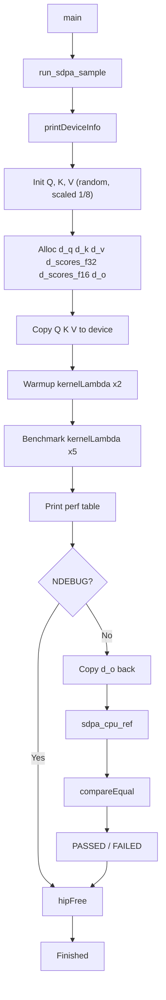
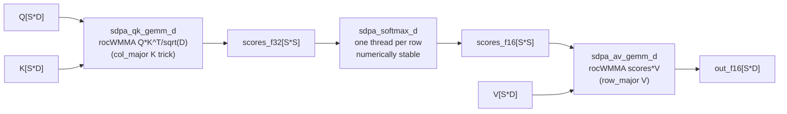

# simple_sdpa — Scaled Dot-Product Attention Sample

## Overview

This sample implements single-head **Scaled Dot-Product Attention (SDPA)** using rocWMMA:

```
O = Softmax( Q * K^T / sqrt(d_k) ) * V
```

**Application**: Core compute kernel of every Transformer attention layer (GPT, LLaMA, BERT).

---

## Algorithm

| Step | Operation | Shape |
|---|---|---|
| 1 | Raw scores: `S = Q * K^T` | `[seq x seq]` |
| 2 | Scale: `S = S / sqrt(D)` | in-place |
| 3 | Row-wise softmax: `A = softmax(S)` | `[seq x seq]` |
| 4 | Output: `O = A * V` | `[seq x D]` |

Default: `SEQ_LEN = 64`, `HEAD_DIM = 64`.

---

## Three-Pass GPU Implementation

```
Pass 1  sdpa_qk_gemm_d   rocWMMA: Q[S*D] x K^T[D*S] / sqrt(D)  ->  float32 scores[S*S]
Pass 2  sdpa_softmax_d   scalar:  row-wise softmax float32       ->  float16 scores[S*S]
Pass 3  sdpa_av_gemm_d   rocWMMA: scores_f16[S*S] x V[S*D]      ->  float16 output[S*D]
```

### Design Rationale

| Decision | Reason |
|---|---|
| Float32 scores workspace | Prevents FP16 overflow in raw attention scores before softmax |
| One thread per row in softmax | Numerically stable; no warp-level DPP reduction needed → Wave32/Wave64 safe |
| Two float16 intermediates | float32 workspace (Pass 1→Pass 2) + float16 attention map (Pass 2→Pass 3) |

---

## K^T Trick — No Explicit Transpose

K `[S x D]` is stored row_major. K^T `[D x S]` is realized by loading K with **col_major fragB** and `ldb=D`:

```
ptr = k + ki + cCol * D

col_major element(r, c) = ptr[r + c*D]
                        = k[ki + r + (cCol + c)*D]
                        = K[cCol+c][ki+r]
                        = K^T[ki+r][cCol+c]  ✓
```

No extra memory allocation or transpose kernel needed.

---

## V Row_major Loading (Pass 3)

V `[S x D]` is stored row_major with `ldv=D`. Loaded as **row_major fragB**:

```
ptr = v + ki * D + cCol

row_major element(r, c) = ptr[r*D + c]
                        = v[(ki+r)*D + cCol+c]
                        = V[ki+r][cCol+c]  ✓
```

---

## Data Layouts

| Matrix | Shape | Layout | Leading dim |
|---|---|---|---|
| Q | `S x D` | row\_major | D |
| K | `S x D` | row\_major | D (K^T via col\_major fragB trick) |
| V | `S x D` | row\_major | D |
| scores (f32) | `S x S` | row\_major | S |
| scores (f16) | `S x S` | row\_major | S |
| O | `S x D` | row\_major | D |

---

## Architecture Compatibility

Tile size: `ROCWMMA_M = ROCWMMA_N = ROCWMMA_K = 16`

| Architecture | Wave size | Status |
|---|---|---|
| gfx9 (MI200/MI300) | 64 | Supported |
| gfx11 (RDNA3) | 32 | Supported |
| gfx12 (RDNA4, gfx1201) | 32 | **Verified PASSED** |

---

## File Structure

```
simple_sdpa.cpp   - kernels + host driver
simple_sdpa.md    - this document
```

---

## Building

```bash
cmake --build . --target simple_sdpa
```

Or all samples:

```bash
cmake --build . --target rocwmma_samples
```

---

## Running

```bash
./samples/simple_sdpa
```

Default: `S=64`, `D=64`. Validation active on Debug builds (`!NDEBUG`).

---

## Program Flow



---

## Kernel Flow



---

## Validated Output (gfx1201 / AMD RX 9070)

```
=== GPU Hardware Info ===
  Device name     : AMD Radeon RX 9070
  GCN arch        : gfx1201
  Compute units   : 28
  Warp size       : 32
  Global memory   : 16304 MiB
========================

SDPA: S=64  D=64  scale=1/sqrt(64)=0.125

QK  grid=(1,1)  block=(128,4)
SM  grid=(1)    block=(64)
AV  grid=(1,1)

BlkM  BlkN  BlkK  S    D    elapsedMs   GFlops       TFlops/s
16    16    16    64   64   0.177082    0.00104858   0.0296071

Validating against CPU reference...
PASSED!
Max relative error: 0.000154823
```

> **Note**: GFlops counts 2 GEMMs × 2\*S²\*D FLOPs = 4\*S²\*D. For S=D=64 this is very small — this sample is pedagogical, not performance-oriented.

---

## Application Context

```
Transformer attention head
  Q = input * W_Q   [seq x d_k]
  K = input * W_K   [seq x d_k]
  V = input * W_V   [seq x d_v]

  Attn = Softmax( Q * K^T / sqrt(d_k) ) * V   <-- this sample

For multi-head: run this kernel once per head, or use batched GEMM.
```

---

## Validation Notes

- CPU reference computes double-precision GEMM + row softmax + GEMM to generate ground truth
- GPU uses FP16 inputs with FP32 accumulation (MFMA) + FP16 softmax output
- Typical `max_relative_error < 0.001` for the default small-integer inputs
- FP16 softmax introduces rounding; values near zero may have higher relative error
